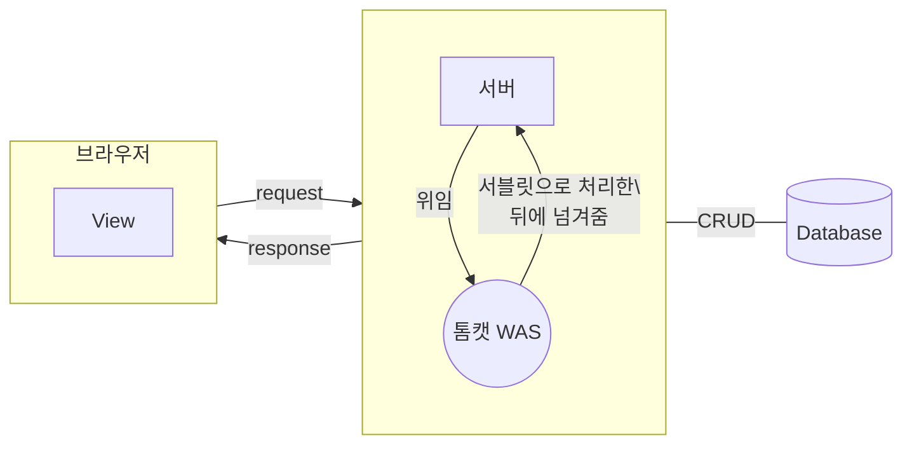

# 개요
>[!info]- [[Java]] 1.8버전 / [[이클립스]] IDE / 아파치 톰캣을 기준으로 설명
- 서블릿은 JavaEE 패키지의 Javax 클래스를 사용
- [서블릿 공식 웹 사이트](http://www.servlets.com/)

>[!cite]- 이클립스 서블릿 기본 세팅방법
> ![[이클립스#WAS 세팅]]

# 서블릿 이해하기


- [[웹 브라우저]] :  거대한 인터프린터로 서버에 요청/응답을 받는 클라이언트로 View를 구현
- View에서 HTTP 메세지로 요청(Request)를 받으면 서버는 일일히 요청에 반응해서 프로그래밍된 대로 작동하고, 이후 데이터를 응답(Response)하게 됨
- 서버를 편하게 작성하기 위해 사용하는 것이 WAS고, 서버는 WAS에게 모든 것을 위임하고 WAS는 서브릿이 작동된 뒤에 처리한 것을 서버에 다시 반환하게 된다. 그렇게 View 단에서 동적으로 데이터가 변동되는 것을 볼 수 있음

## 웹 서버와 WAS의 차이점  [출처](http://sungbine.github.io/tech/post/2015/02/15/tomcat%EA%B3%BC%20apache%EC%9D%98%20%EC%97%B0%EB%8F%99.html)
- 웹 서버 : 정적 웹페이지
	- http 웹서버는 http 요청을 처리할 수 있는 웹서버
	- apache http 서버는 http요청을 처리하는 웹 서버 
	- 클라이언트가 get, post, delete 등을 이용해 요청시 결과를 돌려주는 기능
- WAS(WebApplictionServer) #WAS :  동적 웹페이지를 구동시킬때 사용
	- 서블릿을 담아두는 컨테이너로 서블릿을 생성, 작동 및 소멸까지 알아서 하는 [[API]]
	- 함수처럼 요청이 있을때 내부의 프로그램을 통해서 결과를 생성하고 클라이언트에게 전달하는 기능, 웹 서버에서 요청을 받으면 WAS가 구동
	- 톰캣 : 자바 기반 오픈 소스 WAS, Servlet/[[JSP]] 컨테이너
	- WAS를 통해 [[Servlet|서블릿]]과 [[JSP]]파일이 [[Java]]파일로 변환됨
		- 자바로 저장되는 데이터와 Scope로 저장되는 데이터의 차이가 어떻게 될까? #질문 
- apache tomcat : 합쳐서 아파치 톰캣이라고 부르는 데 실제로는 아래처럼 기능이 다르대
	- apache : 웹서버
	- tomcat : WAS
- [[웹 개발론#2. 정적/동적 페이지란?]] 둘의 차이는 데이터가 동적으로 변하는지 안변하는 지가 기준

## 서블릿의 특징
- 동적웹페이지를 구현하기 위해서 사용됨
	- 보통 View단은 [[JSP]], Contoller단은 서블릿으로 구현
	- [[JSP]]에 비해 서블릿은 View단 구현이 힘들다.
- 자바 클래스 중 하나로 모든 서블릿 파일은 `HttpServlet` 클래스를 상속받아서 구현되었기에 자바 문법을 그대로 사용
	```mermaid
	graph RL
		 구현["HttpServlet"]--상속--> id2((GenericSevlet)) --상속--> id1((Servet))
	```
- 서블릿은 싱글톤패턴을 가짐 
- [[HTML]]과 연결하여 사용됨
	- MVC 디자인 패턴으로 작성하면 [[HTML]] 문서가 많아질수록 서블릿의 양도 늘어나기에 용량이 많고 버거워짐 
	- 그래서 나온 디자인 패턴이 [[front controller]]임 
- [[Java#Java EE|자바 EE]] 기술
	- 위에서 기술했듯이 서블릿 파일은 HttpServlet 클래스를 상속받아서 구현되므로 개발자는 서버에서 처리되어야 하는 기능의 일부분만 작성하면 됨
- **서블릿 프로그래밍이 기존 웹서버 프로그래밍과 다른점**
	- 객체를 생성하고나 호출하는 주체가 서블릿 컨테이너( #WAS)로 사용자가 생성❌
		- 서블릿 프로젝트를 생성했을 경우 폴더 구조를 변경하면 안됨 (이미 구현 되어있기에 추가만해서 사용하면 됨)
		- WAS 안에서만 작동
		- 자바의 main을 이용해 프로그램을 실행하지 않음
	- 서블릿 클래스에서 생성하는 객체도 서블릿 컨테이너에서 관리 ex) 서블릿 생명주기 메서드
	- 서블릿이나 [[JSP]] 코드는 자바 언어 API와 동일하게 사용됨
		- 서블릿 API도 동시 사용
		- 단, 서블릿 API는 관련 라이브러리 필요


## 서블릿의 생명주기 메서드
- 초기화 과정 → 메모리에 인스턴스 생성 → 서비스 수행 → 소멸
- 서블릿은 각 요청 실행 단계마다 호출되며 기능을 수행하는 콜백 메서드들이 있음
    1.  `init()` : 생성시 초기화 작업 수행(서블릿 요청시 맨 처음 단, 한번만 호출), 생략가능
    2.  `doGet() / doPost()`
        1.  작업 수행 → 서블릿 호출시 매번 호출, 실제로 클라이언트가 요청하는 작업을 수행
        2.  서블릿 구현의 핵심으로 반드시 구현
    3.  `destory()` : 종료(서블릿 기능을 수행 후 소멸될때 호출되는 메소드 / 서블릿 마무리 작업시 주로 수행), 생략가능
- 서블릿 동작과정과 코딩 순서가 동일함
	1. 서블릿 클래스 만들시 → 개발자 코딩
	2.  서블릿 생명주기 메서드 구현 -> inint(), doGet()이나 doPost 사용, destory()
	3. 서블릿 매핑 작업 : web.xml 또는 어노테이션 사용(병행불가)
	4.  클라이언트 (웹브라우저) 서블릿 매핑이름 요청
	5. 어노테이션 과정을 거쳐서 주소창에 get방식으로 출력


## 서블릿에서의 [[HTTP]] 통신
- 클라이언트로부터 요청이 들어오면 어떤 서블릿 자바 파일을 실행할지를 먼저 기술해야 함
- 아파치 톰캣 서버가 실행되면 web, xml 어노페이션을 알아서 요청이름과 실행될 자바 파일을 매핑시켜서 서블릿 컨테이너에 등록하여 차곡차곡 쌓아둠
- HTTP 에러는 번호에 따라서 어떤 오류인지 짐작할 수 있음
	- 404에러 : 매핑이 잘못되었을 경우 발생


- **Request와 Response** : 브라우저에서 정보전달요청을 위해 사용하는 방법
	- Request 요청
		- Get : 주소창과 함께 값이 전달되는 방식	->  doGet에서 처리
			- 단순 링크로 처리가 됨, 링크로 데이터가 넘어가기에 보안에 취약. 따라서 내부적으로 개발자들이 파라미터를 넘겨줄때만 사용
			- 특정 정보를 조회하거나 보낼때만 사용
			- 형식 : `Context/매핑명?속성명=속성값&속성명2=속성값2...` #Query_String 
		- Post : body영역과 함께 넘어감 -> doGet에서 처리
			- 주소와 데이터를 따로 보내는 방식 
			- 폼에서 입력한 데이터를 `submit` 시 호출
			- 웹 화면을 통해 실제 처리가 필요한 작업을 하기 위해 사용
	- Response 응답
- 연관 :  [[Servlet#서블릿과 HTML 연동하기]]

# 서블릿 기본 코드
``` java
package view;
import java.io.IOException;
import javax.servlet.ServletConfig;
import javax.servlet.ServletException;
import javax.servlet.annotation.WebServlet;
import javax.servlet.http.HttpServlet;
import javax.servlet.http.HttpServletRequest;
import javax.servlet.http.HttpServletResponse;
@WebServlet("/HelloServlet3")
public class HelloServlet3 extends HttpServlet {
	private static final long serialVersionUID = 1L;
	public void init(ServletConfig config) throws ServletException {}
	public void destroy() {}
	protected void doGet(HttpServletRequest request, HttpServletResponse response) throws ServletException, IOException {}
	protected void doPost(HttpServletRequest request, HttpServletResponse response) throws ServletException, IOException {}
}
```
- `@WebServlet("/HelloServlet3")` : 어노테이션, 매핑방식
- `init` : 생성될때 호출
- `doGet / doPost`  
	- 기본 값이 get이기에 서블릿 파일을 실행하면 init이 실행된 뒤에 get이 실행되는 것을 볼 수 있음
- `destroy` : 소멸될때 호출


## 서블릿 매핑방식
- 매핑이란 : 주소창에 보여지는 url 패턴을 일괄되게 맞춰주는 것을 말함 
- 소문자로 작성하는 것이 관습

1. Web.xml 방식
	```xml
	<servlet>
		<servlet-name>서블릿 이름</servlet-name>
		<servlet-class>view.HelloServlet</servlet-class>
	</servlet>
	<servlet-mapping>
		<servlet-name>서블릿 이름</servlet-name>
		<url-pattern>/helloservlet</url-pattern>
	</servlet-mapping>
	```
2. 어노테이션 서블릿 매핑
	```java
	@WebServlet("/HelloServlet3")
	```
 * 기존의 web.xml은 설정시 번거롭고 불편하기에 톰캣 7버전부터 어노테이션을 이용해 매핑하기 시작함 (단, 반드시 HttpServlet을 상속받은 클래스에서만 사용가능)
 * 서블릿 클래스에 `@WebServlet("/HelloServlet3")`을 이용해 표시해주면 가독성도 좋고 편리

### 매핑값과 함께 서블릿과 HTML 연동하기
```html
<form action="loginpage" method="get">
	아이디 : <input type="text" name="user_id" id="user_id"> <br><br>
	비밀번호 : <input type="password" name="user_pw" id="user_pw"> <br>
	<input type="submit" value="로그인">
	<input type="reset" value="리셋">
</form>
```
- 매핑을 통해 설정한 문자열을 통해서 HTML과 연동할 수 있음
- 기본적으로 한페이지에 form은 하나만 사용

>[!cite]- HTML form을 서버와 사용하기
>![[HTML#서버와 사용하기]]


##  데이터 가져오고 출력하기
### 인코딩 설정
- 요청 받은 데이터를 처리할 때는 requset의 인코딩 설정을 맞춰야 한글이 깨지지 않고 나오며, 응답해서 데이터를 넘겨줄때는 response의 인코딩 설정을 맞춰줘야 함
- requset 방식
	```java
	request.setCharacterEncoding("UTF-8");
	```
- response 방식
	```java
	response.setCharacterEncoding("UTF-8");
	response.setContentType("text/html;charset=utf-8");
	```

### 데이터 가져오기
- `getParameter`를 사용해서 가져올 수 있음 키는 name에 써져있는 대로 작성할 것 
	```java
	Sting id = request.getParameter("user_id");
	```
- 배열을 데이터로 가져오려면 `getParameterValues`를 사용
	```java
	String[] input = request.getParameterValues("pw");
	```

### 데이터 출력하기
- 서블릿은 HTML로 데이터를 표시하려면 아래와 같이 해야 하기에 불편, 그래서 나온 것이 [[JSP]]로 JSP는 HTML 구조 안에서 자바 코드를 작성
- `response.setContentType` 을 통해 HTML을 출력하거나 파일을 다운 받을 수 있음
	- 아래 코드는 제출과 동시에 HTML를 View에서 표시하게 함
	- `HttpServlet`의 `getWriter()`를 이용해 문자열을 가져오고 이를 통해서 출력
- 예시코드
	```java
	response.setContentType("text/html;charset=utf-8");
	PrintWriter out = response.getWriter();
	out.println("<html><body>아이디 : "+ id+"비밀번호 : "+ pw+"</body></html>");
	out.close();
	```
- 서블릿 파일을 먼저 실행시켰으면 해당 내용이 출력되는 것을 볼 수 있음
- 데이터는 예외처리가 필수
- `close()`를 하지 않으면 퍼포먼스가 떨어짐


## 데이터 전송방식
>[!cite]
>[HTTP 요청 메세지로 데이터를 전달할때 3가지 방법 존재](https://velog.io/@rg970604/2.-%EC%84%9C%EB%B8%94%EB%A6%BFHttp%EC%9A%94%EC%B2%AD-%EB%8D%B0%EC%9D%B4%ED%84%B0)

### Get (기본값)
1. 서블릿에 데이터 전송시 데이터가 URL 뒤 `속성명=속성값` 형태로 전송되며 주소창에 보임
2. 여러 데이터 전송시 &로 구현
3. 보안에 취약
4. 최대 256비트
5. 기본 데이터 전송방식
6. 웹 브라우저에 직접 입력 전송가능
7. 서블릿에서 doGet()을 이용해 데이터 처리

### Post
1. 서블릿에 데이터를 전송시 데이터가 body영역에 담겨진 채 전송되며 주소창에 안보임
2. 용량제한 없음
3. Get 방식에 비해 보안에 용이하지만 데이터를 암호화하지 않으면 소용없음
4. 서블릿에서 doPost()를 이용해 데이터 처리


## 포워딩
![[포워딩#포워딩이란?]]

### 포워딩 메소드
![[포워딩#서블릿의 포워드 방법]]

## [[바인딩]] binding
![[바인딩#바인딩이란?]]


### 디스패처 예시구문
- request의 [[Scope]]는 웹 페이지 하나당 한개씩이므로 새로운 웹 페이지에서는 데이터가 공유되지 않음


# 브라우저 데이터 접근방식
- 웹 프로그램 실행시에 데이터를 서블릿 관련 객체에 저장하는 방법이 나옴 (WAS가 알아서 해줌)
- 3개의 객체를 통해서 접근하는데 이 데이터 저장영역을 [[Scope|스코프]]라고 함
- [[Scope]] 비교시 Request < Context < Session 순임
	- **HttpServletRequest** : 요청될때마다 호출
	- **ServletContext** : Project 당 하나씩 (전체 서블릿간의 공유 데이터)
	- **HttpSession** : 브라우저가 종료되기 전까지 데이터를 가지고 있음 (각 사용자마다 가지는 메모리)
- 저장된 데이터는 서블릿으로 JSP에서 서로 전달하고 공유하며 사용
- 무조건 key, value (String 타입)

##  Session API (HttpSession 객체 사용)
- HttpServletRequest와 getSession()메소드 호출
- getSession() : 기본 세션 객체가 존재하면 반환, 없으면 새로 생성
```java
//최초 요청시 세션 객체를 새로 생성하거나 또는 기존 세션 반환 = getSession() 사용
HttpSession session = request.getSession();

//생성된 객체의 객체 id를 가져옴
System.out.println("세션 아이디 : "+session.getId() +"<br>");

// 최초 세션 생성시간
out.println("최초 세션 생성시간 : " + new Date(session.getCreationTime()) +"<br>");

// 세션 객체 가장 최근 접근한 시간
out.println("가장 최근 접근시간 : " + new Date(session.getLastAccessedTime()) +"<br>");
// 세션 객체 유지 유효시간 = 기본은 30분
out.println("세션 유효시간 : " + session.getMaxInactiveInterval() +"<br>");

if (session.isNew()) { // 새로운 세션인지 아닌지 확인할때 사용, 클라이언트 세션 id를 할당하지 않은 경우 true리턴
	out.println("새로운 세션");
}
session.invalidate(); // 세션 강제 삭제 : 브라우저와 서버의 연결 정지
```


# 서블릿 메소드
## Request 메소드
> 주소창과 관련된 메소드들이 많음

| 메소드 명                      | 설명                                                        | 예시                                                                     |
| ------------------------------ | ----------------------------------------------------------- | ------------------------------------------------------------------------ |
| request.getScheme()            | http 같은 통신규약명 호출                                   |                                                                          |
| request.getRequestURL()        | 요청이 온 URL 주소명을 전체 출력                            |                                                                          |
| request.getRequestURI()        | 요청이 온 URL 주소명을 일부 출력                            |                                                                          |
| request.getServletPath()       | 요청이 온 서블릿의 주소 출력                                | /RequestBasic                                                            |
| request.getServletContext()    | 서블릿 실행환경 정보                                        |                                                                          |
| request.getHeader()            | 헤더 정보                                                   |                                                                          |
| request.getSession()           | 최초 요청시 세션 객체를 새로 생성하거나 또는 기존 세션 반환 | HttpSession session = request.getSession();                              |
| request.getRequestDispatcher() | 디스패쳐                                                    | RequestDispatcher name = request.getRequestDispatcher("이동할 페이지명") |
| request.getParameter()         | 가져올 파라미터 키명                                        |                                                                          |
| request.setParameter()       |            파라미터 값 설정                                                 |                                                                          |


## Response 메소드
> [[포워딩]]

| 메소드명 | 설명 | 
| -------- | ---- | 
| response.setCharacterEncoding("utf-8") | 인코딩 처리     |
| response.sendRedirect | 쿼리스트링으로 값을 넘겨줄 수 있음  |
| response.addHeader    | 시간을 지정하고 맵핑을 넘길 수 있음 |


## HttpSession 객체
```java
package session;

import java.io.IOException;
import java.io.PrintWriter;
import java.util.Date;

import javax.servlet.ServletException;
import javax.servlet.annotation.WebServlet;
import javax.servlet.http.HttpServlet;
import javax.servlet.http.HttpServletRequest;
import javax.servlet.http.HttpServletResponse;
import javax.servlet.http.HttpSession;


@WebServlet("/loginsession")
public class Session01Basic extends HttpServlet {
	private static final long serialVersionUID = 1L;
	protected void doGet(HttpServletRequest request, HttpServletResponse response) throws ServletException, IOException {
		// 인코딩
		request.setCharacterEncoding("UTF-8");
		response.setCharacterEncoding("UTF-8");
		response.setContentType("text/html;charset=utf-8");
		
		// 값 할당
		String userId = request.getParameter("user_id");
		String userPw = request.getParameter("user_pw");
		
		
		// 출력
		PrintWriter out = response.getWriter();
		out.println("로그인 아이디는 " + userId + "입니다.");
		out.println("<br>");
		out.println("로그인 비밀번호는 " + userPw + "입니다.");
		out.println("<br>");
		out.println("<br>");
		
		// 세션 생성
		// 리퀘스트에서 세션을 받아오기
		HttpSession session = request.getSession();
				
		out.println(session.getId());
		out.println("<br>");
		// 세션 존재유무
		// 새 세션인지 확인하기
		if(session.isNew()) {
			out.println("새로운 세션");
			out.println("<br>");
			if(userId != null) {
				session.setAttribute("user_id", userId);
				out.println("<a href='loginsession'> 로그인 상태확인(id 값이 있으면)</a>");
			} else {
				out.println("<a href='login.html'>id 값이 없으므로 로그인 하세요</a>");
			}
			out.println("<br>");
		} else {
			// 최초 요청이 아닐때(이미 세션에 값 저장후) id를 가져와 이전에 로그인을 했는지 여부 확인
			// 세션에 입력받은 데이터를 저장하는게 키포인트
			String id = (String)session.getAttribute("user_id");
			if (id != null && id.length() != 0) {
				out.println("안녕하세요" + id +"님!!"); //세션값 적용
			} else {
				out.println("아이디 값이 없으므로 다시 로그인하세요");
				session.invalidate(); // 세션 해제
			}
		}
		
		
		
		out.close();
	}
	protected void doPost(HttpServletRequest request, HttpServletResponse response) throws ServletException, IOException {
		doGet(request, response);
	}
	

}

```


# 서블릿 디자인 패턴
## MVC
- Model : [[Java]]
- View : [[JSP]]
- Cotoller : Servlet

오라클(=SQL?)에서 함


## [[front controller]]


# 용어정리
## 쿼리 스트링( #Query_String)
- 정의
	- 특정한 주소(URL)에 포함된 추가적인 데이터로 form을 통해 제출된 데이터를 쿼리 스트링 형식으로 받음, 문자열로만 전송이 가능함
- 쿼리스트링의 형식 : `Context/매핑명?속성명=속성값&속성명2=속성값2...`
	- key=value 쌍으로 이뤄져있고 여러개를 사용할 때 &를 붙임
	- 동일한 키는 중복이 가능함
	- 문자열만 가능 / 갯수제한이 있음 (최대 256비트)
	- 웹 브라우저에 직접 입력해서 데이터를 전송가능
	- 참고) 서버단 프로그래밍 시 쿼리스트링의 키들을 매개변수(파라미터 paramter)라고 함

# 에러에 대처하기
- 404 에러시 대처방법
	- [이클립스 톰캣 설정 수정](https://dev-handbook.tistory.com/32)
	- [경로지우고 재시작](https://clsrn4561.tistory.com/10)
	- [이외의 방법 링크 모음](https://october-east-sea.tistory.com/160)

# 연관문서