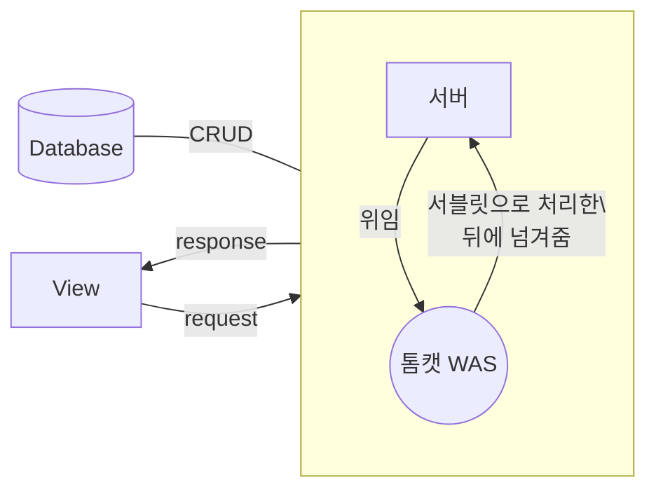

# 개요
>[!info]-
> - 웹의 흐름
> 	- URL 입력(http 등)되면 DNS 서버에서 IP 주소로 변환해서 되돌려줌
> 	- 클라이언트는 해당 IP주소의 웹 서버에서 페이지를 요청하게 됨 
> 	- 웹서버에서 index.html 페이지를 요청하고 전송하게 됨
> 	- 브라우저는 해당 HTML 요소를 분석 및 인터프린트
> - [[웹 디자인]] 
> - [[웹 브라우저]]
> - 프론트엔드 : 앞에 보이는 면
>> |      | [[HTML]]              | [[CSS]]                | [[JS]]         |
>> | ---- | --------------------- | ---------------------- | -------------- |
>> | 정의 | 웹 페이지 의미와 구성 | 웹 페이지의 모양/ 표현 | 기능/동작      |
>> | 주석 | `<!--주석-->`         | `/*주석*/`               | `// or /*주석*/` |
>> | 버전 | HTML5                 | CSS3                   | ECMA 2021      |
> 
> - 백엔드 : 데이터와 통신하는 면
> 	- 데브옵스 (dev-ops) : 서버에 올리고 설정 및 데이터베이스 설정 등 서버 설정을 해서 라이브 상태가 되었을 때 오류가 나지 않게 하는 작업
> - [[네트워크]]
> 	- [[HTTP]]
>- 그외
> 	- [[Node.JS]]를 설치시 [[JS]] 라이브러리 관리를 도와주는 패키지 매니저 npm이 딸려옴 
> 	- 번들링 툴 : [[JS]]파일 다 합쳐줌 (webpack이 코드 관리해서 중복된 코드를 지워줌)
> 
> - **클라이언트 사이드 랜더링(CSR)** : [[HTML]]생성을 [[JS]]로 하는 것을 말함
> 	- [[HTML]] 동적 생성 라이브러리 : vue, svelte, react, angular
> 	- 단점
> 		- 변수 관리가 어렵기에 state management를 사용해야 함
> 		- 구글 검색 결과 노출이 어려움
> 		- 초기 로딩속도 저하
> - **서버 사이드 랜더링(SSR)** : 서버에서 [[HTML]]을 생성하는 것을 말함 
>  - **코드 적용 순서 : java -> HTML 파싱 -> 인라인 js, css -> 외부 js, css**

# 프론트엔드 : 앞에 보이는면
|      | [[HTML]]              | [[CSS]]                | [[JS]]         |
| ---- | --------------------- | ---------------------- | -------------- |
| 정의 | 웹 페이지 의미와 구성 | 웹 페이지의 모양/ 표현 | 기능/동작      |
| 주석 | `<!--주석-->`         | `/*주석*/`               | `// or /*주석*/` |
| 버전 | HTML5                 | CSS3                   | ECMA 2021      |

## 기초 지식
### 1. 폰트 사이즈 단위
| 단위   | 설명                                                                                               |
| ------ | -------------------------------------------------------------------------------------------------- |
| px     | 표준 단위, 고정된 값                                                                               |
| em, %  | 부모 크기에 따라 상대적으로 결정되는 단위 <br> ex) 부모요소 12px일때, 자식요소 1.2em이면, 12x1.2=14.4px |
| rem    | 최상위 태그에 정의된 사이즈를 기준으로 배수                                                        |
| vh, vw | 뷰포트 값에 따라 결정되는 단위, 1vh는 실제 높이값의 1/100, 반응형 제작시 유용                      |

- 원하는 값 계산 : 정하고 싶은 사이즈 / 기본 폰트 크기
#### 폰트 형식
- .eot : ms에서 만든 폰트로 font-face 처음 도입 -> IE8 이하버전은 .eot만 인식
- .woff : ttf/otf 압축버전, 다른 글꼴 형식보다 빠르게 로드 : 웹에서 사용할 목적으로 개발
- .ttf : 맥/윈도우의 가장 일반적인 글꼴 IE8 지원안함 단점은 용량이 큼

####  웹 폰트 사용방법
- HTML <link> 방식    
- CSS @import 방식
    ```css
    @import url(/*웹 폰트 주소*/)
    .noto{	font-family : 'Noto Serif KR', serif; }
    ```
- CSS @font-face 규칙
    ```css
    @font-face{
    	font-family: base-font;
    	src: local(abcdefg),
    			 local(hhijklmnop),
    			 url(/*웹 폰트 주소*/);
    }
    body{ font-family : base-font, serif; }
    ```
-  로컬에 이 폰트를 참조 존재 안할시 다음 폰트 → 다음 폰트도 존재 안할시 웹 폰트에서 가져옴
- **구글 웹 폰트** : 절대 URL(예: )이 아니라 `src`상대 URL : [Google Fonts](https://fonts.google.com/)


### 2. 사용할 수 있는 컬러값
- **RGB** rgb(255, 0, 0)
	- **RGBA** rgba(0, 0, 255, 1.0)
	- **HSL** hsl(0, 100%, 50%)
		컬러Hue, 채도Saturation, 명도Lightness 세 가지를 사용하여 컬러를 표현하는 방식
	- **HSLA** hsl에서 투명도 추가
- **16진수** `#0000ff`
- **표준 컬러 이름** green
- **투명도 속성** opacity (0.0~1.0)
- **그래디언트(그라데이션)** : 2개 이상의 컬러 값을 사용해 표현
	- 선형 크래디언트
	- 원형 그래디언트
	- 구 버전의 브라우저가 그래디언트를 지원하지 않는 경우, ==벤더 프리픽스Vendor Prefix== 를 사용해 예외를 지정할 수 있음 <!--ID: 1684538923326-->


### 3. 멀티미디어 공식 지원 포맷
#### 이미지: jpg, png, gif, svg
|               | 설명                                                                                                                                                                                                                                                  |
| ------------- | ----------------------------------------------------------------------------------------------------------------------------------------------------------------------------------------------------------------------------------------------------- |
| 비트맵 이미지 | -jpg : 손실 압축방식, 가장 보편적으로 사용되는 포맷   <br>-gif : 무손실 압축 방식, 사용색상이 256개로 제한 <br> -png : 색상 수의 제한이 없는 이미지 포맷 <br>&nbsp;&nbsp;&nbsp;jpg와 더불어 가장 많이 사용됨 투명배경 지원, gif와 달리 256 단계의 반투명 효과까지 지원                                                                                                                  |
| 백터 이미지   | -svg : 웹 디자인, 개발 시 다양한 크기의 아이콘, 애니메이션 효과등에 사용됨이미지 파일과 동시에 [[XML]] 문법을 기반으로 하는 문서 <br> &nbsp;&nbsp;&nbsp;➡️ 웹 문서 안에 소스 코드 형태로 삽입할 수 있으며, [[CSS]] 속성을 이용해 애니메이션이나 [[CSS]] 기능을 적용 가능 |
>[!warning]- 이미지 크기 고려
> 용량이 너무 크거나 고화질 이미지를 사용하면 해당 페이지를 로딩하는 데 데이터를 많이 쓰고 시간도 오래 걸릴 수 있으므로 문제를 해결하는 방법으로 작은 용량으로 변환한 썸네일 이미지를 기본으로 보여주고, 사용자가 원할 때 고해상도 대용량 이미지를 보여주거나 내려받는 방법을 사용한다. 단순히 이미지의 width, height만 수정해서 모든 경우에 대응하려고 하면 안됨


#### 동영상: .mp4, .ovg, .webm
- .mp4
- .ovg
- .webm


### 4. 절대주소와 상대주소
- 절대 주소 : [https://naver.com](https://naver.com) 등
- 상대 주소
    - 현재 문서를 기준으로 주소를 찾는 방식
    - 현재 문서가 소속된 폴더를 `.`으로(`./hello.jpg`), 현재 문서의 부모 폴더를 `..`으로(../b/world.jpg) 표현
```text
- Test
	- └ a
		- └ hello.jpg
		- └ 현재문서.html
	- └ b
		- └ world.jpg
```


### 5. 행과 열에 대해서
![[Pasted image 20221017190813.png]]

### 엔터티 코드(entity code, entity name)
- 특수문자(’<’,’>’등) HTML에서 사용되고 있는 예약어는 그대로 출력이 안되기에 [엔터티 코드](https://entitycode.com/)를 사용하여 출력하게 됨
- 엔터티는 예약된 문자를 구현하거나 키보드로 쉽게 입력할 수 없는 문자를 표현하는 데 사용
	-  아스키 코드나 유니코드와 비슷하게 국가별로 여러가지 버전이 존재
- 자주 쓰는거 정리

| 엔터티 코드            |         |
| ------------------------- | ---------------------- |
| `&nbsp;`                  | 공백                   |
| `&#8361;` 또는 `&#x20a9;` | 한국 원화 기호(₩) 표기 |


### URL과 URI의 차이
- URL가 상위 개념이고 URI는 하위 개념
	- URL(Uni Form Resoure Location) 
		- 리소스가 있는 정확한 위치를 말함(전체 경로를 말함)
	- URI (Uni form Resoure identifier)
		- 리소스 위치를 식별할 수 있는 것(상대 경로를 말함)

## 프론트엔드 성능 최적화
>[!info] 성능 최적화의 목표 :  브라우저에 빠르게 출력되게 하기

- 웹 페이지 로드 최적화
	- 리소스 최적화
		- 이미지를 사용자의 통신 환경에 맞게 이미지 용량 줄여서 전송
		- css와 js 모듈화하며 속도 빠르게 하기
- 웹 페이지 랜더링 최적화
	- 레이아웃 최적화
		- JS 실행시간 최적화 #이해부족 
			- 강제 동기 레이아웃 피하기
			- 레이아웃 스레싱 피하기
		- HTML, CSS 최적화
			- dom이 작고 깊이가 얕을 수록 계산이 빠름
			- css가 복잡하고 많을 수록 스타일 계산과 레이아웃이 오래 걸리므로, 복잡한 선택자는 피한다
		- 애니메이션 최적화
			- 한 프레임 처리가 16MS(60fps)내로 완료되어야 랜더링 시 끊기는 현상 없이 자연 스러운 렌더링을 만들어 낼 수 있으므로 애니메이션을 구현시 네이디브 JS API보다 CSS 사용을 권장

>[!cite]- 참고 문서
> - [프론트 엔드 성능 최적화](https://velog.io/@kmlee95/%ED%94%84%EB%A1%A0%ED%8A%B8%EC%97%94%EB%93%9C-%EC%84%B1%EB%8A%A5%EC%B5%9C%EC%A0%81%ED%99%94)
> - 웹 페이지 최적화
> 	- [HTML 이미지 최적화](https://velog.io/@lky5697/fast-images)
> - 웹 페이지 랜더링 최적화
> 	- [reflow란](https://wit.nts-corp.com/2017/06/05/4571)
> 	- [reflow의 원인과 마크업 최적화 Tip](https://daumui.tistory.com/12#daumHead)
> 	- [랜더링 엔진과 Reflow, Repaint, Compostie.](https://ssocoit.tistory.com/258)

### 웹 페이지 최적화
#### 리소스 최적화
- 모듈하는 법
- 

#### 이미지 최적화
- [[HTML]]에서 picture 태그를 사용해서 포맷을 지정 가능
- 비동기 이미지 디코딩
	- low 속성을 추가하여 다운로드 우선순위를 낮춤
- 직접 이미지 용량을 줄이던가
- 리소스 힌트
- alt 텍스트 추가
- sizes 속성에 대한 이해


### 웹 페이지 랜더링 최적화(Reflow와 Repaint를 최소화하기)
- 선행 필수 : [[웹 브라우저#웹 브라우저 랜더링]]


#### 레이아웃 최적화
- 클래스 변화에 따른 스타일 변화를 원할 경우, 최대한 DOM 구조 상 끝단에 위치한 노드에 추가 ( reflow가 일어나지만 성능 문제를 최소화 할수 있음)
- **인라인 스타일을 최대한 배제** : HTML 코드내 인라인 스타일을 사용하는 것보다 CSS로 분리하기
- **테이블 레이아웃 피하기**
	- 사용한다면 `table-layout:fixed`를 사용하면 랜더링을 빠르게 할 수 있음
- JS 통해 스타일 변화를 주어야 할 경우, **가급적 한번에 처리하라**
- **CSS 하위 선택자는 필요한 만큼만 정리** (가급적 적을 수록 좋다)
- **`position:relative` 사용에 주의**
	- css 레이아웃 계산시 Box model-> Normal Flow(포지션 속성 등) 순으로 계산이 진행되는데 float이나 position 속성별 과정은 아래처럼 진행됨
		1. float 속성 : 박스모델 -> normal flow -> floating
		2. relative처럼 top,left 등 위치값을 가진 요소
			- 박스모델 -> normal flow -> positioning
		3. absolute, fixed : 박스모델 -> postitioning 

#### 애니메이션 최적화
- 브라우저가 할일을 줄여야 부드러운 애니메이션이 나옴, 따가서 재조정(reflow)와 재색칠(repaint)는 애니메이션 구현의 핵심요소
- 클래스 변화에 따른 스타일 변화를 원할 경우, 최대한 DOM 구조 상 끝단에 위치한 노드에 추가 ( reflow가 일어나지만 성능 문제를 최소화 할수 있음)
- 애니메이션 등 변경이 잦은 요소는 `position:fixed`나 `absolute`를 적용하면 페이지 전체가 아닌 해당 요소만 reflow가 발생하므로 reflow의 영향을 줄일 수 있음
- **will-change 속성 사용하기**
	- will-change 속성 사용시 해당 레이어는 GPU에 업로드 됨
	- 사용시 주의점
		- 루프 애니메이션에서는 사용하지 말기(캐싱이 새로되어서 애니메이션을 새로 읽음)
		- 조금더 빨리 적용하기 위해 will-change를 적용하면 안됨
		- 애니메이션 동작이 끝난 후 기본 상태로 되돌리기
		- 너무 많은 속성과 요소에 will-change 속성을 사용하지 않기
- **캐시를 활용하자**


### 웹 성능 측정 도구
- [Jennifersoft사의 jennifer front 소개글](https://velog.io/@dochis/%EC%9B%B9-%ED%94%84%EB%A1%A0%ED%8A%B8-%EC%86%8D%EB%8F%84-%EA%B0%9C%EC%84%A0%EC%9D%84-%EC%9C%84%ED%95%9C-%ED%95%84%EC%88%98%EB%8F%84%EA%B5%AC-%EC%86%8C%EA%B0%9C#-%EC%98%A4%EB%8A%98-%EC%82%AC%EC%9A%A9%ED%95%A0-%EB%8F%84%EA%B5%AC)

## 모바일 최적화

## 웹 접근성
- 누구나 인터넷을 이용하기 편하게 하기 위한 지침
- 웹 접근성 개념
	1.  이해의 용이성
		1.  콘텐츠는 이해할 수 있어야 한다.
		2.  주로 사용하는 언어를 기본언어로 명시해야 한다.
		3.  프레임, 콘텐츠는 논리적인 순서로 제공해야 한다
		4.  보조기기 사용자 고려
			1.  스크린 리더 등 보조기기를 사용하는 사용자가 콘텐츠의 의미를 이해할 수 있도록 제공해야 한다.
	2.  운용의 용이성
		1.  사용자 인터페이스 구성요소는 조작가능하고 네비게이션 할 수 있어야 한다.
		2.  페이지, 프레임, 콘텐츠블록에는 적절한 제목을 제공해야 한다.

>[!cite]- 참고 문서
> - [W3C 접근성 기준 개요](https://www.w3.org/WAI/standards-guidelines/ko) : 공식 지침 사이트
> - [웹 접근성 설명](https://velog.io/@layssingcar/%EC%9B%B9-%EC%A0%91%EA%B7%BC%EC%84%B1-%EC%A7%84%EB%8B%A8-%EB%8F%84%EA%B5%AC)

![[유용한 사이트 정리#^20f237]]


####  HTML 웹 접근성
1.  화면 낭독기 `<html lang="kr">` 한글억양으로 말함
2.  `hr`을 이용해 문단이 넘어가는 걸 인식
3.  `strong` 와 `em`태그는 낭독기에서 읽을 때 강조해서 읽어주는 역할을 한다.
4.  `q`태그는 낭독기에서 인용이라고 말해주는 기능
5.  `img`의 `alt` 기능도 있음
6.  라벨과 인풋을 연결했을 때, 라벨만 클릭해도 인풋에 포커스 되는 기능


## Webpack이란


# 백엔드 : 데이터와 소통
>[!info] **백엔드** : 서버, [[데이터베이스]] 등 사용자에게는 보이지않는 뒷 작업을 말함
> - 웹 서버, 웹 애플리케이션 서버 등 세부적인 구분이 있음 
> - 리눅스 OS(우분투)로 서버 많이 돌림

- **개발 언어** : [[Java]], [[python]] 등
	- 자바에서는 서블릿([[Servlet]])을 사용해 동적 웹페이지를 제작
- **동적 웹 페이지 설계** : asp, [[JSP]], php
- **DB** : 데이터의 영속적인 저장을 위해 서버사이드에서 주로 다룸
	- **데이터 관리** :   데이터는 단 1%의 결점도 없어야 함(데이터의 무결성)
	- **대표적인 데이터 관리언어** : PHP, [[python]], [[SQL]] 등
		- redux 상태관리 : 클라이언트단에서 사용하는 데이터 관리를 위함
		- RDBMS : [[오라클]]
	- **데이터 소통** : [[XML]], [[JSON]], [[JS]]등
	- 자바와 DB 연결 API 
		- [[JDBC]]
		- [[커넥션 풀 API]]
	- DB 접속의 업무단위를 트랜젝션이라고 함
- IDE : [[이클립스]]
- 미들웨어 (WAS)
	- 아파치 톰캣


## 백엔드의 흐름

- [[웹 브라우저]]가 인식하는 것은 HTML, CSS, JS 뿐이라서 Servlet이나 JSP 코드를 HTML 안에 넣는다고 해도 WAS를 거치지 않으면 인식불가능


## 서버시스템
> 정보자원의 효율적 분산 및 정보 이용자의 접근을 쉽게 구현하기 위해 **클라이언트/서버 컴퓨팅**과 같은 정보기술을 이용한 정보시스템


- 서버 이전에는 메인프레임 사용, 지금은 메인 프레임을 잘 사용하지 않음
- **DNS(도메인 네임 시스템)** : 인터넷 IP주소를 사용자가 기억하기 쉽게 문자로 변환해줌.
    이 DNS를 운영하는 서버를 네임 서버(name server)라고 함.
    DNS 서버를 변조하여 다른 가짜 사이트로 사용자를 보내게 만드는 것을 파밍이라함.

>[!cite]- 서버 클라우드 서비스의 종류
> - 오라클  [Oracle Cloud Free Tier 체험하기](https://www.oracle.com/kr/cloud/free/)
> - 구글 Cloud
> - 네이버  [NAVER CLOUD PLATFORM](https://www.ncloud.com/)

### 윈도우 개발환경
- **WSL** : 윈도우에서 리눅스 커맨드를 실행 가능한 프로그램? 
	- [윈도우로 개발을 한다고? feat. WSL](https://www.youtube.com/watch?v=7eVG4o8mS_I)
	- 맥/리눅스는 유닉스를 기본으로 하기 때문에 해당 OS가 개발할 때 편함
		-  리눅스와 맥은 공통된 점이 많음
- 도커영역?
- **리눅스**
	- [가장 쉬운 리눅스 강좌](https://www.youtube.com/watch?v=tPWBF13JIVk)
	- 리눅스로 돌아가는 서버를 다루는 등 개발 중에 리눅스 관련 작업을 하게 됨
-  방법
	1.  우분투 + 버추얼 박스
	2.  구름 IDE에서 빈 우분투를 이용해 가상 리눅스환경만들기
	3.  구글 클라우드 플렛폼에서
	4.  윈도우 WSL에서

# 웹 브라우저의 저장공간
>[!info] [[Scope|스코프]]

웹 페이지가 새로 생성되면 Req와 Res가 새로 생성됨
웹 페이지간의 데이터 공유가 안됨 
- 스코프 범위가 좁아서
따라서 null 값이 출력됨
값을 얻어오고 싶으면 포워드 필수
- [!] Scope 영역에 저장된 값만 뽑아와서 사용하니까 객체로 저장된 값을 가져올 수는 없음
	- 따라서 객체에 접근하기 위해서는 변수로 선언하는 과정을 거쳐야 함
- 브라우저에서 값을 넘겨받는 방식은 주로 쿼리스트링 방식
- key와 value값 모두 String으로 저장되며 value가 없을 시 null 값이 세팅
	- 초기값 개념인가봐
	- 토큰과 쿠키 : 웹 app과 웹 브라우저, 각각 서버에 요청하는 방식
- 저장공간 확인 방법 
  ![[Pasted image 20230407144044.png|400]]

## 세션 Session
- 서버 메모리에 정보를 저장한 후 웹 페이지들끼리 공유
- 로그인 페이지는 거의 세션을 이용해 구현
- 세션이 서버쪽 코딩?
- 세션도 쿠키의 일종

### 세션을 이용한 웹 페이지 연동
- 웹 페이지들끼리 공유 정보를 서버에 저장 / 웹 페이지들을 매개해주는 방법
- 서버의 메모리에 생성되어 정보를 저장
- 로그인처럼 보안이 요구되는 정보는 대부분 세션을 이용
- ⭐각 브라우저 당 한개 (= 사용자당 한개가 생성)

### 세션 실행과정
- 클라이언트 브라우저 -> 서버에 최초 접속 
	- 서버의 서블릿은 세션 객체를 생성
	- 세션 객체에 대한 세션 id를 브라우저에 전송 
		(서버에 저장후 불러와서 브라우저에 또 저장)
	- 브라우저는 서버로부터 받은 세션 id를 브라우저가 사용하는 세션 쿠키에 저장
	- 서버로부터 전송된 세션 id도 일종의 쿠키
- 클라이언트 브라우저 -> 재접속시 
	- 세션 쿠키에 저장된 세션 id를 다시 서버로 전송
	- 서버에서는 전송된 세션 id를 이용
	- 브라우저 세션 객체에 접근하여 브라우저에 대한 작업 수행
### 세션의 중요한 특징
- 브라우저당 한개 생성 -> 사용자당 한개 생성
- 브라우저 종료시 세션 해제


# 웹 개발 이론
## 1. 램스택, 민스택, 잼스택 등의 기술
- **램(LAMP)스택** : 리눅스(Linux) os, 아파치(Apache)라는 web server, 마이SQL(MySQL)이라는 데이터 베이스 관리 시스템, PHP/파이썬(Python) 같은 프로그래밍 언어의 앞자들을 딴 조합
- **민(MEAN)스택** : 몽고DB(MongoDB), 익스프레스JS(ExpressJS), 엥귤라JS(AngularJS), 노드JS(NodeJS)라는 자바스크립트 프레임워크를 이용한 웹 구조
- **잼(JAM)스택** : [[JS]], API, Markup
	- **장점** : 클라이언트와 백엔드(API로)의 분리
	  ![[전통적인 웹 개발 구조 (위)와 잼스택 구조(아래).png|300]]
		- 보안 취약점 보완
		- CDN을 통해 웹 성능이나 속도를 높일 수 있으며, 사용자가 늘어날 때 웹사이트 규모를 쉽게 확장할 수 있음
	- **단점** : 다양한 기능과 요구 사항이 많은 사이트나 동적 페이지 중심이거나 혹은 백엔드 언어에 의존하는 APP은 잼스택 도입이 어려움
	- 잼스택과 함께 묶이는 [정적 사이트 생성기(SSG)](https://www.notion.so/80263dacd7ef476190a0c389b3b73fa5)

>[!cite]- 참고 문서
> - [5 Myths About Jamstack](https://bit.ly/3g9p0zS)
> - [Benefits of the Jamstack – from buzzword to business ready](https://bit.ly/2CFD46x)
> - [What are the pros and cons of using JAMstack?](https://bit.ly/2YuZBuL)
> - [정적 웹으로 서비스 구현하기](https://bit.ly/2Yd9fSt)


## 2. 정적/동적 페이지란? 
|      | 정적(static) 페이지                             |                                          동적(dynamic) 페이지                                           |
| ---- | ----------------------------------------------- |:-------------------------------------------------------------------------------------------------------:|
| 차이 | -클라에서 요청시 서버는 따로 추가 처리 과정 ❌ | -클라에서 요청시 서버에서 사용자 요청을 해석하고 이후 데이터를 가져오거나 특정 기능을 수행하는 과정 ⭕ |
|      | -개발자가 입력한 그대로의 web 화면             |                      -같은 웹사이트 주소여도 사용자마다 보이는 콘텐츠 내용이 다름                      |
| 예시 | 내용이 변하지 않는 웹 페이지                    |                                SNS 등 사용자마다 다르게 보이는 웹사이트                                 |

### 3.1. 정적 사이트 생성기(Static Site Generator, SSG)
> 정적 페이지 기반 웹사이트 제작 도구
> 콘텐츠와 파일을 읽고 이를 [[HTML]]으로 적절히 변환해 주는 기술
- 잼스택 시장을 이끄는 넷틀리파이는 직접 오픈소스 기반 정적 사이트 생성기들의 목록과 그 인기도를 볼 수 있는 ‘스택틱젠’이란 사이트를 운영 중
- 예시 : [정적 사이트 생성기의 예시](https://www.notion.so/fabf69fbd6df440392415c6da69c20f0)


### 3.2. 정적 페이지 저장소 및 웹서버
- AWS S3


## 3. 클라우드플레어 (CDN, content derilvery network)
- CDN이란? 
	- 사용자가 웹 서버에 직접 접속하지 않고 클라우드플레어 서버를 통해서 웹 페이지를 받아감
	- 대역폭 비용 무료

# 보안
## 해킹의 종류
- XSS 공격 
	- 사이트 간 스크립팅, 크로스 사이트 스크립팅은 웹 애플리케이션에서 많이 나타나는 취약점의 하나로 웹사이트 관리자가 아닌 이가 웹 페이지에 악성 스크립트를 삽입할 수 있는 취약점(CSS가 아닌 이유는 웹 기술의 CSS와 헷갈릴 수 있어서)


# 용어정리


## 클라이언트와 백엔드
| 클라이언트 | 백엔드   |
| ---------- | -------- |
| 로컬       | 서버     |
| 네이티브   | API요청  |
| 내부 DB    | 그냥(DB) |
|            |          |

## 프레임워크와 라이브러리의 차이
- **프레임 워크** : 성능, 안정성, 유지보수, 생산성 등을 고려하여 선택함
	- 리엑트, 스프링부트 등
- **라이브러리** : 개발의 편의성을 위해 사용, 프레임워크와 달리 따로 배울필요는 없음
	- JQ 등


## 정보크기, 데이터 전송속도
- **정보 크기 단위(바이트)** : `KB<MB<GB<TB<PB<EB<ZB`
    1024단위 (1MB = 1024KB), KB($2^{10}$), MB($2^{20}$). 2의 10승씩 증가
- **데이터 전송속도 단위(bps)** : 초당 전송 비트의 수(bit/s)
    1000단위 (1Tbps = 1,000Gbps = 1,000,000Mbps = 1,000,000,000Kbps = 1,000,000,000,000bps)
    [사과나무의 정리노트 - 전송속도 bps와 baud 차이점 : 네이버 블로그](https://www.notion.so/bps-baud-f01767a4900244dc97ba974ffe738930
- **페타플롭스(PFLOPS)** : 1초에 부동 소수점 연산을 할 때, 1플롭스라고 하는 데 1초에 3경 3,860조의 연산을 할 수 있으면 페타플롭스(PELOPS)라고 한다. (일반 pc는 0.0003페타플롭스 연산)

## 웹 호스팅
- 웹 호스팅이란?
	- 도메인, URL을 제공하고 운영
	- 이메일, 웹사이트 제작도구, FTP 파일 업로드, 웹사이트, 데이터베이스, 서버 등

## SSR과 CSR
- 서버 사이드 렌더링
- 클라이언트 사이드 렌더링

## null 체크
- 고정값 이외의 값은 동적으로 변하니까  처음 로딩시 null이 기본값으로 들어가니까 고정값을 넣어주기 위해서 사용


## 페이징
페이징이란 **논리주소의 메모리를 고정된 크기의 페이지(Page)로 나누어 관리하는 기법

## 정규표현식에 대해서
- JS, JSP, VScode 등 많이 들어보긴했는데 정리가 안된느낌


# 연관 문서