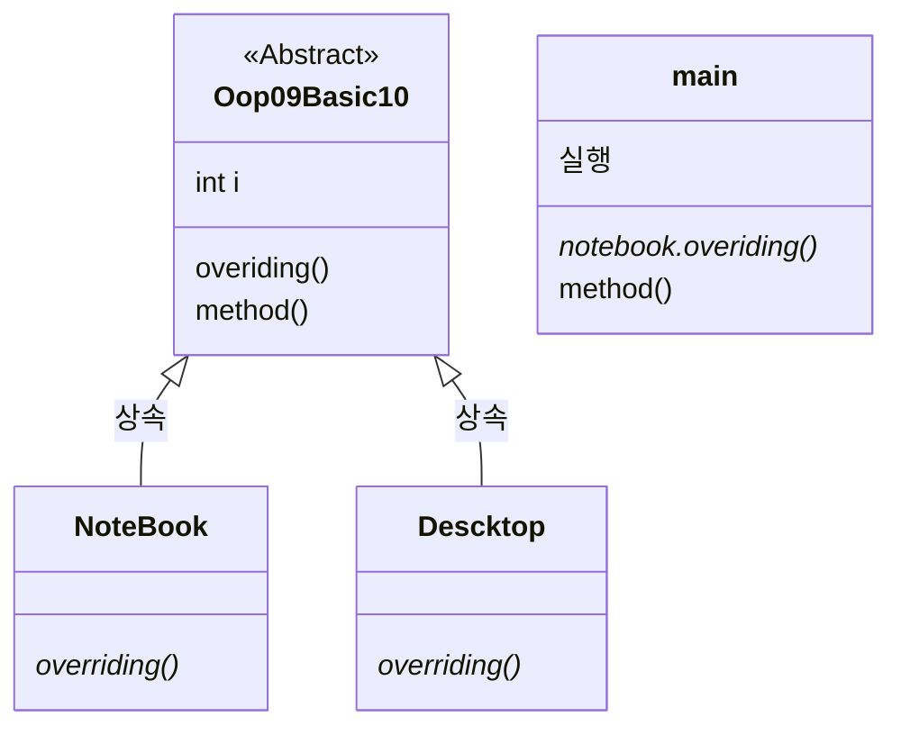

# 개요
>[!info]- zulu8 JDK / 자바 1.8 버전 / IDE([[이클립스]] 2021-06) / 톰캣 8.5.78v 기준 설명

-  VSC에서 자바하려면 JDK 17버전 이상 필요
-  **자바에 대해서** 
	- 객체지향프로그래밍 언어 #oop
	- 자바에서는 object가 클래스로 자바의 업무 단위는 프로젝트가 기본
	- **장점** : JVM을 통해 어느 운영체제에서도 작동
	- **단점** : JVM 때문에 작동이 느림
- **자바의 네이밍 규칙**
	- 대문자 : 프로젝트 / 소스파일
	- 소문자 : 패키지
- 자바 공식 문서 보는 법 : api documentation java검색
- 코드 작성형식 
	- 람다식 : 객체지향의 단점을 극복하기 위해서 함수를 쓸 수 있게 해주는 형식

>[!cite]- 참고 문서
> - [Java Platform, Standard Edition Java API Reference](https://docs.oracle.com/en/java/javase/18/docs/api/)
> - [자바 공식 문서: Learning the Java Language](https://taptorestart.tistory.com/entry/%EC%9E%90%EB%B0%94-%EA%B3%B5%EC%8B%9D-%EB%AC%B8%EC%84%9C-Learning-the-Java-Language)

# 자바 설치하기
- [zulu8 오픈자바JDK](https://www.azul.com/downloads/?version=java-8-lts&os=windows&architecture=x86-64-bit&package=jdk#zulu)
- [오라클 / 유료](https://www.oracle.com/java/technologies/downloads/)
- [이클립스_2021-06 R](https://www.eclipse.org/downloads/packages/release/2021-06/r)
- [Apache Tomcat® - Apache Tomcat 8 Software Downloads](https://tomcat.apache.org/download-80.cgi)

>[!cite]- 이클립스 설치 및 기본 설정
> ![[이클립스#기본 설정]]

>[!cite]-  환경변수 설정 : JAVA_HOME, Path
> - 제어판 -> 시스템 환경변수 검색 -> 새로추가 
>   ![[Pasted image 20230417151414.png|400]]
> - Path 시스템 변수를 더블클릭해서 `%JAVA_HOME%\bin`을 추가
>   ![[Pasted image 20230417151555.png|400]]
> - 명령프롬프트에서 Javac라고 입력 (java -version이라고 하면 버전확인가능) 
>   ![[Pasted image 20230417151630.png|400]]


# 자바 문법
```java
import java.util.Scanner;
public class HelloWorld{
    public static void main(String[] args){
        System.out.println("Hello World!");
    }
}
```

|            | 설명                                                                                                                                                                                                                                                                       |
| :----------: | -------------------------------------------------------------------------------------------------------------------------------------------------------------------------------------------------------------------------------------------------------------------------- |
| 외부파일   | 외부파일을 import <br>객체를 사용하기 위해서는 객체를 인스턴스화해줘야함                                                                                                                                                                                                   |
| 접근제어자  | public > protected > default > private <br>• 하나만 사용가능<br>• public : 아무나 접근가능 <br>• protected : 같은 패키지 내부와 상속관계 클래스만 <br>• 아무것도 없을 때(default) : 같은 패키지 안에서만 접근 가능 <br>• private #oop/캡슐화 : 같은 클래스 안에서만 접근가능, 외부에서는 접근 불가능 |
| 메모리공간 | • static : 프로그램 로드시 메모리에 올려두기 때문에 인스턴스 안해도<br> 클래스이름과 점연산자를 통해서 접근가능    <br>• final : 상수, 재정의 불가(새로운 값 대입 불가능)                                                                                                  |
| 리턴타입   | 메소드라면 무조건 리턴 타입이 있어야함                                                                                                                                                                                                                                     |
| 메소드명   |                                                                                                                                                                                                                                                                            |
| 메개변수명 | 형식을 지켜서 작성을 해야 함                                                                                                                                                                                                                                               |
| 주석       | • `//` : 행주석 <br>• `/* */` : 범위 주석 <br>• `/** */` : 도큐먼트 주석                                                                                                                                                                                                   |

- 작성 순서 : 접근제어자 - 메모리공간 - 리턴타입- 메소드명
- implements는 클래스명 뒤에 작성

## 콘솔 입출력방식
### 출력하기
|         | 줄바꿈 | 예시                               |
| ------- | ------ | ---------------------------------- |
| print   | ❌     | System.out.print("Hello Word!");   |
| println | ⭕     | System.out.println("Hello Word!"); |
| printf  | ❌ | System.out.printf(”출력방식 %*”, 콘솔출력변수); |

1.  개행
    ```java
    System.out.println("icon"
    				+ "Computer");
    ```
2.  Escapse 문자 ( `\\n` 등)
    ```java
    System.out.println(str2 + "\\n"); // 줄 바꿈
    System.out.println("Hello \\"World!\\""); // \\를 통해서 특수문자를 콘솔표시가능
    ```
#### 출력양식 변환기호
|     | 설명                                                          |
| --- | ------------------------------------------------------------- |
| %d  | 정수형 출력                                                   |
| %f  | 부동소수점 출력(소수점 6자리까지 출력하고 7자리에서는 반올림) <br>%.2f식으로 소수점 조절가능|
| %s  | 문자열 길이만큼 출력공간 확보       |

### 입력하기(java.util.Scanner)
```java
package outprint;
import java.util.Scanner; // 포함시키지 않으면 오류

public class Operator2 {
	public static void main(String[] args) {
	// Scanner scan = new Scanner(System.in);
		java.util.Scanner scan = new java.util.Scanner(System.in);
		String input = scan.nextLine();
		System.out.println(input);
	}
}
```
- 자바 util의 Scanner 객체를 이용해야 함


## 데이터 타입
- **기본 데이터 타입 (Primitive type)**
	- 메모리 저장영역 : 스택
	- 종류
		- 정수형 : byte, short, int(기본), long
		- 실수형 : float, double(기본)
		- 논리형 : Boolean
		- 문자 : char(아스키 코드 값을 대입해서 문자를 처리)
	- 초기값 
		- 숫자 : 0
		- char : '\u0000'(공백)
		- boolean : false
	- 크기 비교 : byte (1) < short, char (2) < int (4) < long (4)< float (8) < double (16)
- **참조 데이터 타입 (Reference type)**
	- 메모리 저장영역 : 힙
		스택에서 힙영역에 저장된 참조 데이터 타입의 메모리 번지를 가지고 있음
	- 종류
		- 배열(String 등) 
		- 객체 
	- 초기값 : null
### 케스케이딩
- 강제 형변환
	```java
	int num = (int)"10";
	```
- 기본 데이터타입의 레퍼클래스를 이용한 방법 #래퍼클래스
	```java
	Integer.praseInt(변환할 자료형);
	```
- 자동 형변환
	- 연산시 더 큰 데이터 타입으로 자동 형변환
	- 서로 다른 타입 간의 대입이나 연산을 할때 먼저 형변환으로 타입을 일치시키는 것이 원칙(단, 경우에 따라 컴파일러가 자동으로 생략된 형변환을 해줌)
	- 크거 → 작은거 (오류) / 작은거 → 큰거(오류x) : 데이터타입의 비트크기 기준

### 메모리 공간
![[프로그래밍 언어론#메모리 공간]]

## 자바에서 사용되는 키워드
- 접근 제어자 #oop/캡슐화 
	- public : 아무나 접근가능
	- protected : 같은 패키지 내부와 상속관계 클래스만
	- default(생략시 자동) : 같은 패키지 내에서만
	- private : 같은 클래스 안에서만, 외부는 접근 불가능
- 메모리
	- static #정적메모리 #공용메모리 #oop/클래스변수 
		- 정의
			- 공용으로 사용되는 메모리, 프로그램이 로드 될 경우 필요한 클래스가 호출되는 데 그때, 메모리 영역에 할당되어서 프로그램이 종료되기 전까지 계속 메모리 영역을 잡고 있음
			- 클래스가 객체화 되지 않아도 메모리에 올려두기에 ==인스턴스 안해도== 함수에 접근가능 (클래스 이름과 점연산자를 통해서)
		- 사용해야 할 때
			- 인스턴스 사용 시 : 객체마다 공통적으로 해당 메모리를 사용해야할 때 ex) seriaNum
			- 인스턴스 사용 안할 때 
				- 인스턴스를 안해도 static이 있으면 사용할 수 있기에 객체 없이 써야하는 멤버변수나 인스턴스가 필요하지 않는 멤버 함수들에 사용
	- final #상수 
		- 상수, 재정의 불가(새로운 값 대입 불가능)
	- this
		- 자신의 메모리 주소를 가리키는 키워드
		- [[JS]]에서 있는 this와 동일
- 상속 #oop/상속 
	- extends 
		- 상속 클래스에서만 사용할 수 있는 키워드로 부모 클래스를 상속 받은 자식 클래스는 부모 클래스의 멤버변수와 메소드를 사용가능
		- 인터페이스에서도 상속은 가능
	- super : 상속 받은 클래스에서 부모 클래스를 참조하기 위해 사용
- 구현
	- implements #인터페이스
		- 인터페이스를 받아서 클래스에 상속시킨다고 생각하면 되지만, extends 키워드와는 달리 여러 인터페이스를 연결가능
- 기타 키워드
	- abstract #추상화
		- 추상클래스, 메소드의 구현이 없음 
			- static 메소드는 클래스가 객체화 되지 않아도 함수 호출이 가능한데 abstract에 static을 사용하면 문법적으로 에러가 발생
	- new : 클래스를 인스턴스화 하는 키워드

### 제어자 사용위치
| 위치     | 제어자명                                     |
| -------- | -------------------------------------------- |
| 클래스   | public, default, final, abstract, implements |
| 메서드   | 접근제어자 모두, final, abstract, static     |
| 멤버변수 | 접근제어자 모두, final, static               |
| 지역변수 | final                                        |
| 초기화블록  | static 등                                  |


## 객체지향 개념

![[프로그래밍 언어론#객체지향 프로그래밍(objective programming) oop]]
- 자바에서 최상위 객체는 Object, 모든 객체는 Object에서 상속받음
- 자바에서 기본적으로 자주 사용되는 객체는 불러오지 않아도 메모리에 있음 (ex. math 등)
### 클래스란?
- **패키지** : 작업단위, 클래스 파일의 묶음으로 물리적 계층구조(폴더)를 가짐
- **클래스** : 객체를 정의해 놓은 것 또는 객체의 설계도(틀), 실질적인 작업 기본 단위
	- 클래스 내부에 정의된 목록
		- **멤버변수** : 실제 데이터가 저장되는 영역
			- 필드, 인스턴스 변수라고도 불림
			- 보통 멤버변수에 private을 사용해 get/set 메서드를 정의, 사용해서 멤버변수에 접근하게 함 #자바VO
		- **메소드** : 행동하는 부분
			- 정의
				- 메소드(method) 또는 멤버 함수(member function)라고도 불림
				- 데이터와 멤버 변수에 대한 접근 권한을 가짐. 
				- 함수와의 차이점
					- 함수와 메소드가 공존하는 언어(파이썬)가 있기도 하지만 자바는 클래스를 떠나서 존재하는 것은 없기에 자바에서는 함수가 존재하지 않고 클래스 내에서 존재하는 데 이 **클래스 내의 함수**를 메소드라고 부른다.
			- 분류
				- 메인 메소드(엔트리포인트) : 프로그램의 시작지점
					```java
					public static void main(String[] args){}
					```
				- 보조 메소드 : 메인 이외의 메소드
			- 메서드 수행이 끝난 뒤 자동으로 메모리 공간에서 사라짐
				- [?] #질문 호출되면 다시 메모리 공간에 적재되는 식인가? FIFS 방식으로?
		- [[Java#생성자(constructor)|생성자]] : 클래스를 인스턴스할 때 호출되며 초기화 역할을 담당
	- 클래스를 [[Java#인스턴스(instance)|인스턴스]]화한 것을 객체라고 함
	- 접근제어자에 따라 클래스 간에도 접근할 수 있는 범위가 제한됨
	- 기타
		- 클래스의 이름과 파일명이 같아야 찾기도 쉬움
		- 보통 프로그래머들은 클래스 이름 첫 글자를 영문 대글자로 쓰고, 인스턴스 이름은 첫 글자를 영문 소문자로 써서 구분하곤 한다.
#### 인스턴스(instance)
- new 키워드를 이용해 클래스를 객체로 생성하는 과정을 말함
- 정의
	- 'int'와 마찬가지로 클래스는 해당 클래스를 만든 프로그래머가 미리 선언해 두기에, 클래스를 선언하는 파일과 인스턴스를 선언하는 파일이 다르다. 이렇게 별도로 선언하는 것은 '객체지향 프로그래밍'의 특징 때문
		- String은 기본형이 아닌 객체라 new 키워드를 사용해서 생성해야하지만 사람들이 많이 사용하다보니 new 생성자를 사용하지 않아도 간단히 쓸수 있게 허용해줌
	- 클래스를 선언 후 인스턴스를 만들 때, [[Java#생성자(constructor)|생성자]] 자체가 일종의 변수형으로 인식됨
	- 메모리 도식도
		```mermaid
		classDiagram
		    Hip <|-- Stack
				클래스 --> 객체 : 생성자로 인스턴스화
				객체 --> Stack
		    class Hip{
		      객체의 메모리 공간 마련
		    }
		    class Stack{
		      생성자변수 : 객체의 주소값 저장 
		    }
		    class 클래스{
			    멤버변수
			    Method()
		    }
		
		    class 객체{
		      멤버변수는 각 자료형에 
					해당하는 자료값으로 초기화
		    }
		```


#### 생성자(constructor)
- 정의
	- new 키워드를 통해 인스턴스 과정에서 호출됨 (따라서 안만들어도 JVM이 생성)
		- 객체를 초기화하는 목적으로 보통 사용됨 
		- 생성자는 메소드가 아님
	- 클래스를 만들 때 생성자를 코딩해서 인스턴트시 코드를 줄일 수 있음. 또한 생성자는 오버로딩 가능
- 형식
	- 생성자의 이름은 클래스와 동일하게 짓는다.
	- 생성자 이름 앞에 return 값의 변수형이나 void ❌
- 생성자 오버로딩
	```java
	public Car() {
			this("red", "auto", 4); //반드시 첫번째 줄에서만 실행
		}
	public Car(String color, String type, int door) {
		this.color = color;
		this.type = type;
		this.door = door;
	}
	```
	- 오버로딩시 this를 이용하여 디폴트 생성자에 기본 값 세팅을 할 수 있음
		- 생성자 이름으로 클래스 이름 대신 한 생성자에서 다른 생성자를 호출하는데 반드시 디폴트 생성자에서만 호출 및 오버로딩된 생성자가 존재해야함


### 상속(extends) #oop/상속 
- **상속이란?** 
	- 객체지향의 장점인 유지보수에 유용한 특징으로 기존 개발된 프로그램에 새로운 내용만 추가하게 해줘서 편리
- **상속의 특징**
	- [*] 자바는 단일상속만 지원 
		- 자식 클래스는 부모 클래스를 하나밖에 못가짐
	- [*] 상속시 부모클래스의 생성자가 먼저 호출됨
		- 상속에서 하위 클래스는 (묵시적) ==상위클래스객체 타입으로 형변환됨 ==(→ 다형성과 관련) 따라서 상위클래스로 하위클래스의 메소드를 실행가능
	- [?] 메모리 번지에 대해서 #질문 
		- 자식클래스는 부모 생성자를 호출하니까 부모객체는 자식객체보다 먼저 생성되며 그 이후 자식객체는 부모 객체를 가리기케 됨
		- 여기서 객체를 생성할때 메소드말이야 새로 생성되서 메모리 영역을 잡아먹는것보다 하나 생성하고 그 주소값을 가리키는게 낫지 않나? 멤버버수는 데이터가바뀌니까 생성하는게 필수지만 메소드는 아니잖아
- **상속시 주의점**
	- 상속되는 것은 부모 클래스의 멤버변수와 메소드 뿐 (이외의 생성자등은 상속 안됨)
		- [!] 자식클래스에서 오버라이딩 된 메소드가 있다면 부모 메소드 대신 오버라이딩 된 메소드가 호출됨
		- [!] 자식클래스에서 오버라이딩 된 메소드 아래에 새로 선언시 호출이 불가능
			```mermaid
			classDiagram
				부모클래스 <|-- 자식클래스 : 상속
				class 부모클래스 {
					멤버변수
					void method01()
					void method02()
				}
				class 자식클래스 {
					멤버변수
					void method02() 오버라이딩
					void method03() 새로 선언
				}
				class main{
					실행
					method01() 
					method02() 오버라이딩된 메소드 출력
					method03() 호출 불가능
				}
			```
#### 상속 형식
```java
class Sub extends Supper{
	public Sub(){ // 디폴트 생성자
		super.Supper(); // super 키워드로 부모 생성자 호출
	}
}
```
-   이렇게 확장을 하면 `Sub`는 클래스 선언시 아무런 내용을 작성하지 않더라도 `Supper` 클래스에 있는 변수와 메소드를 사용가능
	```mermaid
	flowchart LR
		Sub-.상속.-> Supper
			subgraph Supper
				Supper01
			end
			Supper01["상위, 조상,\\n 부모 클래스"]
			subgraph Sub
				Sub01
			end
			Sub01["하위, 자식 클래스\\n상속받은 멤버변수와 메소드를\\n 사용하는 구체적인 클래스가 됨"]
	```


### 추상클래스
- 정의
	- 기능성을 확장해 다양한 프로그램을 개발할 수 있는 클래스를 말함
	- 추상메서드에는 구현코드가 없이 선언부만 존재
		- 하나의 메서드라도 구현되지 않으면 추상클래스임
	- 하위클래스는 추상클래스를 상속받아서 구현해야함
		- 상속계층도에서 아래로 내려갈수록 구체화되는 정도가 심해짐
	- 사용이유
		- 새로운 클래스 코딩시 어느정도 틀을 갖춘 상태에서 시작하는 것이 효율적이니까 추상클래스는 추상메소드의 선언부만 구현
		- 추상메소드의 이름은 누구라도 무슨 기능을 하는 지 알 수 있게 네이밍 해야 함

#### 추상클래스 형식
```java
package oop09;
public abstract class Oop09Basic10 {
	int i;
	public abstract void overiding();

//	일반 메서드 구현가능
	public void method() {
		System.out.println("추상클래스 : 전원키기");
	}
}
```



### 인터페이스 
- 정의
	- 일종의 추상클래스
		- 모든 메서드가 추상메서드로 이루어진 클래스 또는 프로그램이 제공하는 기능을 명시적으로 선언(선언부만 작성하는 거)
		- 메서드에 abstract 키워드를 쓰지 않아도 JVM이 자동으로 붙혀줌
	- 자바에서는 전체 개발에 대한 설계를 인터페이스에서 한다고 생각하면 됨 
- 특징
	- 다중 구현이 가능, 쉼표로 구분하여 사용
	- 생성자 사용 불가능 (= 추상메서드와 동일)
	- 인터페이스로부터만 상속가능
	- 리턴 타입은 인터페이스
		- 메서드가 해당 인터페이스를 구현한 클래스의 인터페이스를 반환
- 형식
	- 


### 객체 간의 협력 Corporation

-   클래스 3개가 하나의 패키지 안에 있다고 가정했을 경우 import를 쓰지 않아도 서로의 클래스를 참조하는 것이 가능
	- → 접근제어자를 설정하지 않으면 기본적으로 `default`이기에
	```mermaid
	sequenceDiagram
	    participant Bus
	    participant Student2
	    Student2->>Bus: take() : 내부연산 
			Main->>Student2: takeBus() : take호출 및 돈 감소
			Main->>Bus: showBus() : 버스 정보 출력
	```
-   각 객체를 사물로 보아야함, 멤버함수를 호출하는 것은 한 객체 안에 있는 멤버변수를 조작관리하는데 있어서 용이하니까
	-   멤버함수는 동작을 정의하고, 멤버변수는 동작에 필요한 부품이라고 생각하면 될듯
-   ❗메소드 매개변수로 객체를 사용할 수 있음. 이를 VO(value object)라고 함


- StringBuffer를 사용해서 append 
- 필터링은 어떻게 하는거지?
- 메소드 호출호출

## 예외처리
- try~catch
	```java
	try {
		String[] sub = request.getParameterValues("subject");
		if (sub != null) {
			for (int i = 0; i < sub.length; i++) {
				System.out.println(sub[i]);
			}				
		}
	} catch (Exception e) {
		System.out.println("예외발생");
	}
	```

- throws : 호출하는 쪽으로 뒤에 있는 클래스를 넘겨줌

## 멀티스레드
### 멀티 스레드란?
- 스레드의 구현과 실행벙법 : 두방법 중 하나를 선택하여 run()의 구현부를 코딩을 통해 (쓰레드를 통해 작업하고자 하는 내용을) 채우는 것
- 멀티 스레드의 2가지 방법
	1. thread 클래스 상속 (이경우 다른 클래스를 상속 받을 수 없기 때문에 많이 사용❌)
		```java
		class MyTread extends Thread{
			@Override
			public void run(){구현코드} // Thread 메소드의 run 오버라이딩
		}
		```
	2. Runable 인터페이스 구현
		```java
		class MyTread extends Thread implements Runnable{
			public void run() {}; //Runnable 인터페이스 구현
		}
		```
		1. run()만 정의되어 있음 public abstract void run();
		2. 일반적인 사용방법, 재사용성이 높고, 코드의 일관성을 유지할 수 있기 때문에 좀더 객체지향에 부합하는 방법


## 자바 기본 제공 클래스
### 자바 JDK (Java Development Kit)
- 자바의 소프트웨어 개발키트( #SDK)
- **JDK 구성** #JDK 
	- apt : 어노테이션 툴
	- appletviewer : 웹 브라우저 없이 자바 애플릿을 실행하고 디버깅하기 위한 툴
	- javac : 자바 컴파일러
	- java : 컴파일한 클래스 파일을 해석 및 실행
	- jar : 서로 관련 있는 클래스 라이브러리들과 리소스를 하나의 파일로 묶어주는 툴
	- jdb : 자바 디버깅툴
	- JRE(Java Runtime Enviroment) : 자바가 동작하는데 필요한 JVM, 라이브러리 등 다양한 파일을 포함
	- JVM(Java Virtual Machine) : 자바가 실제로 동작하는 가상환경
		- 어느 운영체제에서도 원활하게 동작가능


### 자바간 패키지 설명
#### Java SE 
- 표준 자바 플랫폼으로 표준적인 컴퓨팅 환경을 지원하기 위한 자바 가상머신 규격 및 API 집합을 포함
- `java.lang.*`, `java.util.*` `java.awt.*`, `javax.rmi.*`, `javax.net.*` 등

#### Java EE
- Java SE에 웹APP 서버에서 동작하는 기능을 추가한 플랫폼
- 이 스펙에 따라 제품을 구현한 것을 웹APP 서버( #was)라고 함
- [[JSP]], [[Servlet]], [[Java]], JNDI, JTA, EJB 등

### 컬렉션 프레임워크(Java Collections Framework)
- 컬렉션 프레임 워크(Java Collections Framework) : 다수의 데이터를 동일한 방식으로 다루기 위해 자바는 자료구조를 인터페이스로 정의한 다음 구현화한 클래스로 제공, 컬렉션 프레임워크는 이렇게 만들어진 인터페이스와 클래스를 뜻하는 말
- 자료구조 클래스화 (인터페이스 —구현—> 클래스)
	- 컬렉션 : 다수의 데이터
	- 프레임워크 : 표준화된 프로그래밍 방식

>[!summary] 간략화한 컬렉션의 구조 (동그라미 : 인터페이스 | 네모 : 구현 클래스)
> ```mermaid
> graph BT
>	Collection(("Collection")) --> Inerable(("Inerable"))
>	List & Set--> Collection
>	ArrayList & Vector & LinkedList -.-> List(("List"))
>	HashSet & TreeSet -.-> Set(("Set"))
>	HashMap & Hashtable & TreeMap & Properties -.-> Map(("Map"))

- Inerable 인테페이스를 상속받는 Collection 인터페이스는 List, Set을 자식으로 가지고 있음
	- \*Collections와는 다름
- Map은 연관이 없지만 둘과 비슷


## 자바 자주 쓰는 메소드/필드 정리
- equals()는 여러 객체에서 오버라이딩 되는데 객체의 내용을 비교하는 데 사용됨
	- 참조타입은 == 키워드를 사용하면 기본타입과 다르게 주소값을 비교하기 때문에 사용
- 

### String 객체
| 메소드명            | 설명                                                 | 반환값  | 매개변수                 |
| ------------------- | ---------------------------------------------------- | ------- | ------------------------ |
| .length()           | 문자열 길이 계산                                     | int     |                          |
| .replace()          | 바꿀 문자열과 대체 문자열을 작성                     |         | 바꿀 문자열, 대체 문자열 |
| .equals()           | 해당 String과 내용을 비교해서 boolean값으로 반환해줌 | boolean |                          |
| .equalsIgnoreCase() | 위와 동일하지만 대소문자 구분을 하지 않음            | boolean |                          |
| .valueOf()          | 기본 타입의 값을 문자열로 변경                       |         |                          |

### Integer 객체
| 메소드명 | 설명 |
| -------- | ---- |
| .parseInt() | 문자열을 int로 변환(integer이외에도 다른 데이터 타입에도 많음) |

### Math 객체
| 메소드명 | 설명                        |
| -------- | --------------------------- |
| .PI      | 파이, 원주율값              |
| .floor() | 내림 (소수점값을 버리는 듯) |
| .ceil() |  올림                     |


# JVM이란?
- 다른 프로그래밍언어와 동일하게 컴파일과 해석과정을 거치지만 JVM(자바 버추얼머신)이 관여하는 점에서 다른 프로그래밍 언어와 다름
- JVM은 엔트리 포인트에서부터 클래스 코드를 읽고 작동

## JVM의 작동 흐름
1.  `.java` 파일이 컴파일되면 `.class` 파일이 됨 (컴파일러는 javac)
2.  `.class`을 JVM이 실행해주는데, OS 메모리를 할당받아서 런타임 데이터 영역을 구성
3.  클래스 로더를 통해서 클래스를 동적 로딩(load-time / run-time으로 나뉨)
	-   엔트리포인트를 찾아서 그부분을 먼저 load-time하는 것 같은데…맞나?
	-   클래스가 로딩되면 먼저 static을 찾아서 Method 영역에 올림(main보다 먼저 로드됨)
	-   오토파싱은 어느순간에 하는거지?
	-   클래스의 바이트 코드는 Method Area에 저장, 이후 실행엔진에 넘겨줌
4.  실행엔진이 코드를 JIT 방식으로 읽음
	-   자바는 특이하게 컴파일을 한다음 당장 안쓰는 건 코드화해놓는 것 같아, 코드화를 해놓고 필요할때 실행엔진이 JIT방식으로 번역해서 실행
5.  코드가 실행되면서 실행엔진이 런타임데이터 영역에 데이터를 올림
	- 가비지 콜렉터는 힙영역을 감시, 사용하지 않는 객체를 데이터영역에서 내림

>[!quote]- JVM 작동 도식화
>```mermaid
>flowchart TD
>	id1[".java"]--컴파일-->id2[".class"]--실행-->id6
>	
>	subgraph JVM
>		id5["실행엔진 (Exeution Engine)"]<-->id8
>		id6["클래스 로더\\n(Class Loader)"]<-->id8
>		id5<-->id6
>		subgraph id5["실행엔진 (Exeution Engine)"]
>			JIT
>			INterPreter
>			id7["가비지 콜렉터\\n(Garbage Collector)"]
>		end
>
>		subgraph id6["클래스 로더\\n(Class Loader)"]
>		
>		end
>
>		subgraph id8["런타임 데이터 영역 (Runtime Data Area)"]
>			subgraph id10["스레드 공유됨"]
>				id100["Heap Area"]
>				id200["Method Area"]
>			end
>			subgraph id11["스레드 공유안됨"]
>				id300["Stack Area"]
>				id400["PC Register"]
>				id500["Native Method Stack"]
>			end
>		end
>	end
>
>	subgraph id800["Native Method"]
>		id600["Interface"]
>		id700["Library"]
>		id700-->id600
>	end	
>```

## JVM 용어 정리
- 스레드
	- 프로세스(메인 스레드) : 응용 프로그램의 실행 중인 객체
	- 스레드 : 작업단위 / 실행단위
- 실행엔진(Exeution Enfine) : JVM을 실행
	- 클래스 로더 (Class Loader)
		- 클래스를 동적 로딩(load-time / run-time으로 나뉨)해줌 
		- 클래스를 런타임 데이터 영역에 전달 이후에 실행엔진에 바이트 코드를 제공
	- 가비지 콜렉터 (Garbage Collector)
		- 쓸모 없어진 메모리를 회수
	- JIT 
		- JVM은 컴파일된 자바 코드를 자기만 읽을 수 있게 다른 방식으로 코드화한다고 함
		- JIT는 [[프로그래밍 언어론]]에서도 말했듯이 한줄한줄 읽어서 실행하는 인더 프린터 방식의 일종
- 런타임 데이터 영역(Runtime Data Area) : 데이터가 저장되는 영역
	- 힙 (Heap Area)
		- 참조 데이터가 생성되는 영역으로 가비지 콜렉터의 주요 감시 부분
		- eden(young)과 old로 나눠짐
	- 스택 (Stack Area)
		- 참조 데이터의 메모리 번지값과 원시데이터가 저장되는 곳
	- 메소드영역 (Method Area)
		- 클래스 파일의 바이트 코드가 로드되는 곳
		- 클래스별로 static, final, 메소드, 생성자가 올라감
	- PC 레지스터 (PC Register)
		- 스레드의 부분 주소가 저장되는 영역
		- 현재 실행중인 JVM 주소를 가지고 있음
		- #질문 이부분이 JVM을 어느 OS에서도 동작할 수 있게 해주는건가?
	- 네이티브 메소드 스택 Native Method Stack
		- 자바 외 언어의 네이티브 메서드를 지원하기 위한 메모리영역 (보통 C/C++ 코드 수행을 위한 스택)


# 디자인 패턴
- [[소프트웨어 디자인 패턴]]

## 싱글톤 패턴 Singleton Pettern
- 인스턴스를 한개만 생성해서 사용하는 것, static에 인스턴스를 하나만 구현해놓음
-  절대 바뀌지 않는 것을 해당 부분에 작성해둠
-  규칙
	1.  반드시 생성자를 `private`으로 만듬, 클래스 내부에서만 생성하고 제어할 수 있도록
	2.  클래스 내부에서 `static`으로 유일한 인스턴스를 생성
	3.  메서드는 반드시 `public`, 인스턴스 외부에서 사용할 수 있도록
	4.  싱글톤 인스턴스에 접속, 실제 구현코드 작업
	```mermaid
	graph LR
	  변수1 --> 싱글톤객체
		변수2 --> 싱글톤객체
		subgraph hip
			싱글톤객체
		end
	```

## MVC(Model-View-Controller)
>[!summary] Model(자바) - View(JSP) - Controller(서블릿)
> ![[Pasted image 20230417164711.png|400]]


# DB에 연결하는 방식 
- [[JDBC]]와 [[커넥션 풀 API]] 방식을 통해서 DB와 연결할 수 있음
	- 연결한 후에는 자바에서 데이터를 [[CRUD]]하면 됨
- 데이터를 화면에 출력하는 방식 #비지니스_로직 #기술면접 
	1. **JSP 방식**
		- 정의 
			- [[JSP]]를 이용해서 화면에 출력하는 방식으로 [[Servlet|서블릿]]이나 다른 페이지를 거치지 않고 직접 [[Java]]를 통해서 [[데이터베이스|DB]]와 연결함
			- 비지니스 로직이 복잡하지 않을 경우 주로 사용
		- 장점 : 컨트롤과 뷰가 통합되어 있어 다른 페이지를 거치지 않아서 코드를 보기에 직관적
		- 단점 : 보안에 취약, 코드 재활용 불가능 
	2. **Model 1 방식**
		- 정의
			- [[Servlet|서블릿]]에서 바로 [[Java]]를 통해서 DB와 연결하는 방식으로, [[Java]] 연결 코드를 클래스화해서 코드를 재활용 할 수 있게 함
			- Model은 자바, View는 JSP, Controller는 서블릿으로 나뉘어짐
		- 장점 : 컨트롤과 뷰단이 나뉘어져있음
		- 단점 : [[CRUD]]하는 방식을 각각 [[Servlet|서블릿]]에서 작성해주어야 하기에 코드 재활용의 여지가 남아있음
	3. **Model 2 방식**
		- 정의
			- 기존 Model 1 방식과 동일하지만 DB와 연결하여 [[CRUD]]하는 방식을 클래스화한 방식
			- 완전히 코드가 분리되어 있음
		- 장점 : 코드 재활용이 좋음
		- 단점 : 작은 규모의 프로젝트여도 파일이 많이 생긴다는 점? 

# 실습
## MVC 패턴으로 게시판 제작
- 계층형 게시판
	- 계층형 게시판은 


# 용어정리
- 물리적 / 논리적
	- 물리적으로 같다(= 주소값(메모리번지)가 동일하다)
	- 논리적으로 같다(= 주소값은 다르지만 내용은 동일하다)
- 객체 (Object) : 자바에서는 클래스를 지칭, 이를 중심으로 코드를 작성함
- 리터널 : 변수의 값, 그자체
- 엔트리 포인트 : 컴파일을 시작하는 시작점
- 인스턴스 (instance) : 클래스를 사용해 만들어낸 객체로, oop의 주요 특징 중 하나
- 오버플로우 / 언더플로우 : 데이터 형이 허용하는 최대값을 벗어나는 것
- 스레드 (thread) : 프로세스 내에서의 작업 단위로서 시스템의 여러 자원을 할당받아 실행하는 단위
- 오버라이드 / 오버로딩
	- 오버라이드(override) 
		- 슈퍼 클래스에서 정의된 메소드를 서브 클래스에서 재정의 
		- ==메서드의 선언부는 동일, 구현부만 재정의==
	- 오버로딩(overloading)
		- 객체 지향에서 같은 이름의 메소드에 ==다른 매개변수==를 작성한 메소드를 만든다는 의미
- 레퍼 클래스(Wraper Class)
	- 자바에서 자료형은 객체가 아니니까 객체지향에 위배되기에 자료형을 객체로 감싸는 느낌으로 만든 클래스를 레퍼 클래스라고 함
- WAS(Web app system) : 서블릿 컨테이너, 대표적으로 [[Servlet|서블릿]]에서 사용되는 아파치 톰캣이 있음
- 제네릭 : 데이터 타입을 정하고 싶지 않을 때 사용  형식) `<e>`(e는 별 뜻 없을걸)
- [[UML]] : 클래스 도식도
- 어노테이션 (annotation, 주석)
	- 소스코드에 추가해서 사용할 수 있는 메타 데이터의 일종
	- JSP 서블릿 등에서 어노테이션을 이용한다고 함
	- ex) @Override, @Deprecated 등
- 디프리케이티드 (deprecated)
	- 사전 (신조어) 중요도가 떨어져 더 이상 사용되지 않고 앞으로는 사라지게 될 (컴퓨터 시스템 기능 등) 
	- 어노테이션 : 더 이상 사용하지 않는 기능이라고 명시할때 사용 
	- 래퍼클래스처럼 사용을 권장하지 않는 기능을 뜻하기도 함
- 오토파싱 
	- 컴파일러가 자동으로 변환 코드를 삽입
	- 래퍼클래스를 생각할것
- 객체 직렬화
- [[Servlet|서블릿]] : Dynamic Web Page를 만들 때 사용되는 자바 기반의 웹 어플리케이션 프로그래밍 기술
- [[헤시함수]]
	- 헤싱(Hasuhing) 기법에 사용되는 헤시함수를 구현
	- 헤싱은 데이터 관리기법 중 다량의 데이터를 저장하고 검색하는데 있어 유용함
	- 헤싱함수 = 찾고자 하는 값을 입력하면 그 값이 저장된 위치를 알려주는 헤시코드를 반환
	- 보안에서 활용
- [[아스키 코드]]

## Value Object #자바VO 
- 메소드 매개변수로 객체를 사용할 수 있음 
- 값 객체 패턴(Value object pattern) 즉, 객체를 값처럼 쓸 수 있고, 제약사항 중 하나는 객체의 인스턴스 변수가 생성자를 통해서 일단 설정된 후에는 결코 변하지 않음을 보장한다는 것 
-  [[자바빈]] Bean 
	- 객체를 데이터 보관용으로 사용
	- 데이터의 무결성을 위해 private으로 멤버변수를 설정
- 자바 DTO
	- 데이터 이외에 메소드도 있는거
>[!cite]- 참고 문서
> - [Java-VOValue-Object란](https://velog.io/@livenow/Java-VOValue-Object%EB%9E%80)
> - [DAO, DTO, VO](https://velog.io/@ruinak_4127/DAO-vs-DTO-vs-VO)


# 참고 문서


