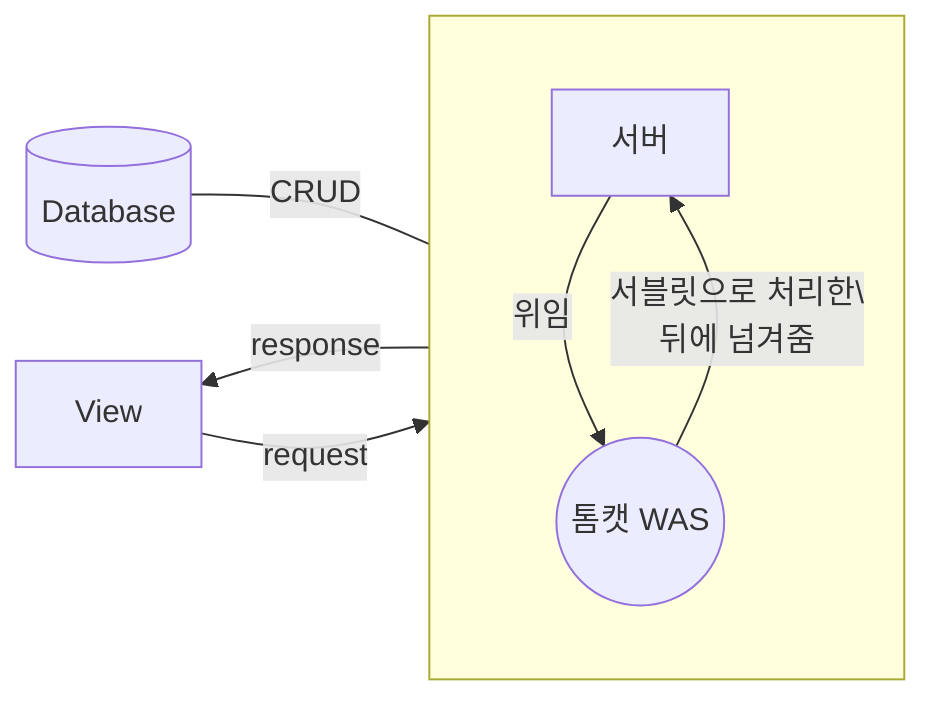

> 대충 각 언어 문법은 페이지에 들어가서 보게하고 구현하는것만 여기서 작성하자 
> 일일히 페이지 나눠서 작성하는거 귀찮으니까...
# 개요
## [[웹 브라우저]]
- 거대한 인터프린터, 서버의 클라이언트, View단을 보여주는 APP 등등....

## 프론트엔드 : 앞에 보이는면
|      | [[HTML]]              | [[CSS]]                | [[JS]]         |
| ---- | --------------------- | ---------------------- | -------------- |
| 정의 | 웹 페이지 의미와 구성 | 웹 페이지의 모양/ 표현 | 기능/동작      |
| 주석 | `<!--주석-->`         | `/*주석*/`               | `// or /*주석*/` |
| 버전 | HTML5                 | CSS3                   | ECMA 2021      |

## 백엔드 : 데이터와 소통
> 📌 **백엔드** : 서버, [[데이터베이스]] 등 사용자에게는 보이지않는 뒷 작업을 말함
> 		웹 서버, 웹 애플리케이션 서버 등 세부적인 구분이 있다. 리눅스 OS(우분투)로 서버 많이 돌림
- **개발 언어** : [[JAVA]], [[python]] 등
	- 자바에서는 서블릿([[Servlet]])을 사용해 동적 웹페이지를 제작
- **동적 웹 페이지 설계** : asp, [[JSP]], php
- **DB** : 데이터의 영속적인 저장을 위해 서버사이드에서 주로 다룸
	- 데이터 관리 :   데이터는 단 1%의 결점도 없어야 함(데이터의 무결성)
	- 대표적인 데이터 관리언어 : PHP, 파이썬, [[SQL]] 등
		- redux 상태관리 : 클라이언트단에서 사용하는 데이터 관리를 위함
	- 데이터 소통 : #XML, #JSON, [[AJAX]]등

# 프론트엔드
## 기초 지식
### 1. 폰트 사이즈 단위
| 단위   | 설명                                                                                               |
| ------ | -------------------------------------------------------------------------------------------------- |
| px     | 표준 단위, 고정된 값                                                                               |
| em, %  | 부모 크기에 따라 상대적으로 결정되는 단위 |
|          | ex) 부모요소 12px일때, 자식요소 1.2em이면, 12x1.2=14.4px |
| rem    | 최상위 태그에 정의된 사이즈를 기준으로 배수                                                        |
| vh, vw | 뷰포트 값에 따라 결정되는 단위, 1vh는 실제 높이값의 1/100, 반응형 제작시 유용                      |

---
### 2. 사용할 수 있는 컬러값
- **RGB** rgb(255, 0, 0)
    - **RGBA** rgba(0, 0, 255, 1.0)
    - **HSL** hsl(0, 100%, 50%)
        컬러Hue, 채도Saturation, 명도Lightness 세 가지를 사용하여 컬러를 표현하는 방식
    - **HSLA** hsl에서 투명도 추가
- **16진수** `#0000ff`
- **표준 컬러 이름** green
- **투명도 속성** opacity (0.0~1.0)
- **그래디언트(그라데이션)** : 2개 이상의 컬러 값을 사용해 표현
    - 선형 크래디언트
    - 원형 그래디언트
    구 버전의 브라우저가 그래디언트를 지원하지 않는 경우, 벤더 프리픽스Vendor Prefix 를 사용해 예외를 지정할 수 있음
---
### 3. 멀티미디어 공식 지원 포맷
### 3.1. 이미지: jpg, png, gif, svg
|            | 포맷 |   설명       |
| ---------- | ---- |--------------------------------------------------------------------------------------------------|
| 비트맵 이미지 | jpg  | 손실 압축방식, 가장 보편적으로 사용되는 포맷 |
|            | gif  | 무손실 압축 방식, 사용색상이 256개로 제한  |
|            | png  |  색상 수의 제한이 없는 이미지 포맷 |
|            |   | jpg와 더불어 가장 많이 사용됨 투명배경 지원, gif와 달리 256 단계의 반투명 효과까지 지원 |
| 백터 이미지  | svg  | 웹 디자인, 개발 시 다양한 크기의 아이콘, 애니메이션 효과등에 사용됨이미지 파일과 동시에 [[XML]] 문법을 기반으로 하는 문서 |
|   |   | ➡️ 웹 문서 안에 소스 코드 형태로 삽입할 수 있으며, [[CSS]] 속성을 이용해 애니메이션이나 [[CSS]] 기능을 적용 가능 |
> **이미지 크기 고려**
> 용량이 너무 크거나 고화질 이미지를 사용하면 해당 페이지를 로딩하는 데 데이터를 많이 쓰고 시간도 오래 걸릴 수 있으므로 문제를 해결하는 방법으로 작은 용량으로 변환한 썸네일 이미지를 기본으로 보여주고, 사용자가 원할 때 고해상도 대용량 이미지를 보여주거나 내려받는 방법을 사용한다. 단순히 이미지의 width, height만 수정해서 모든 경우에 대응하려고 하면 안됨
### 3.2. 동영상: .mp4, .ovg, .webm
- .mp4
- .ovg
- .webm
---

### 4. 절대주소와 상대주소
- 절대 주소 : [https://naver.com](https://naver.com) 등
- 상대 주소
    - 현재 문서를 기준으로 주소를 찾는 방식
    - 현재 문서가 소속된 폴더를 `.`으로(`./hello.jpg`), 현재 문서의 부모 폴더를 `..`으로(../b/world.jpg) 표현

- Test
	- └ a
		- └ hello.jpg
		- └ 현재문서.html
	- └ b
		- └ world.jpg

---

### 5. 행과 열에 대해서
![[Pasted image 20221017190813.png]]
## 모바일 최적화

# 백엔드
> [[Java]] 1.8버전 / [[이클립스]] IDE / 아파치 톰캣을 기준으로 설명

 - Model : Vo.dao
- View : [[JSP]]
- Controller : [[Servlet]]
- JDBC : 자바에서 데이터베이스에 접속할 수 있도록 하는 자바 API

## 백엔드의 흐름

## 서버시스템
> 정보자원의 효율적 분산 및 정보 이용자의 접근을 쉽게 구현하기 위해 **클라이언트/서버 컴퓨팅**과 같은 정보기술을 이용한 정보시스템
---
- 서버 이전에는 메인프레임 사용, 지금은 메인 프레임을 잘 사용하지 않음
- **DNS(도메인 네임 시스템)** : 인터넷 IP주소를 사용자가 기억하기 쉽게 문자로 변환해줌.
    이 DNS를 운영하는 서버를 네임 서버(name server)라고 함.
    DNS 서버를 변조하여 다른 가짜 사이트로 사용자를 보내게 만드는 것을 파밍이라함.

### 참고 : 서버 클라우드 서비스의 종류

1.  오라클  [Oracle Cloud Free Tier 체험하기](https://www.oracle.com/kr/cloud/free/)
2.  구글 Cloud
3.  네이버  [NAVER CLOUD PLATFORM](https://www.ncloud.com/)

### 윈도우 개발환경
- **WSL** : 윈도우에서 리눅스 커맨드를 실행 가능한 프로그램?    [윈도우로 개발을 한다고? feat. WSL](https://www.youtube.com/watch?v=7eVG4o8mS_I)
    - 맥/리눅스는 유닉스를 기본으로 하기 때문에 해당 OS가 개발할 때 편함
	    -  리눅스와 맥은 공통된 점이 많음
    도커영역?
- **리눅스**
    - [가장 쉬운 리눅스 강좌](https://www.youtube.com/watch?v=tPWBF13JIVk)
    - 리눅스로 돌아가는 서버를 다루는 등 개발 중에 리눅스 관련 작업을 하게 됨
-  방법
    1.  우분투 + 버추얼 박스
    2.  구름 IDE에서 빈 우분투를 이용해 가상 리눅스환경만들기
    3.  구글 클라우드 플렛폼에서
    4.  윈도우 WSL에서

# [[네트워크]]

## [[HTTP]]

# 웹 개발 이론
## 1. 램스택, 민스택, 잼스택 등의 기술
- **램(LAMP)스택** : 리눅스(Linux) os, 아파치(Apache)라는 web server, 마이SQL(MySQL)이라는 데이터 베이스 관리 시스템, PHP/파이썬(Python) 같은 프로그래밍 언어의 앞자들을 딴 조합
- **민(MEAN)스택** : 몽고DB(MongoDB), 익스프레스JS(ExpressJS), 엥귤라JS(AngularJS), 노드JS(NodeJS)라는 자바스크립트 프레임워크를 이용한 웹 구조
- **잼(JAM)스택** : [[JS]], API, Markup
    - **장점** : 클라이언트와 백엔드(API로)의 분리![[전통적인 웹 개발 구조 (위)와 잼스택 구조(아래).png|300]]
        - 보안 취약점 보완
        - CDN을 통해 웹 성능이나 속도를 높일 수 있으며, 사용자가 늘어날 때 웹사이트 규모를 쉽게 확장할 수 있음
    - **단점** : 다양한 기능과 요구 사항이 많은 사이트나 동적 페이지 중심이거나 혹은 백엔드 언어에 의존하는 APP은 잼스택 도입이 어려움
        - [5 Myths About Jamstack](https://bit.ly/3g9p0zS)
        - [Benefits of the Jamstack – from buzzword to business ready](https://bit.ly/2CFD46x)
        - [What are the pros and cons of using JAMstack?](https://bit.ly/2YuZBuL)
        - [정적 웹으로 서비스 구현하기](https://bit.ly/2Yd9fSt)
    - 잼스택과 함께 묶이는 [정적 사이트 생성기(SSG)](https://www.notion.so/80263dacd7ef476190a0c389b3b73fa5)
---
## 2. 정적/동적 페이지란? 
|      | 정적(static) 페이지                             |                                          동적(dynamic) 페이지                                           |
| ---- | ----------------------------------------------- |:-------------------------------------------------------------------------------------------------------:|
| 차이 | • 클라에서 요청시 서버는 따로 추가 처리 과정 ❌ | • 클라에서 요청시 서버에서 사용자 요청을 해석하고 이후 데이터를 가져오거나 특정 기능을 수행하는 과정 ⭕ |
|      | • 개발자가 입력한 그대로의 web 화면             |                      • 같은 웹사이트 주소여도 사용자마다 보이는 콘텐츠 내용이 다름                      |
| 예시 | 내용이 변하지 않는 웹 페이지                    |                                SNS 등 사용자마다 다르게 보이는 웹사이트                                 |

### 3.1. 정적 사이트 생성기(Static Site Generator, SSG)
> 정적 페이지 기반 웹사이트 제작 도구
> 콘텐츠와 파일을 읽고 이를 [[HTML]]으로 적절히 변환해 주는 기술
- 잼스택 시장을 이끄는 넷틀리파이는 직접 오픈소스 기반 정적 사이트 생성기들의 목록과 그 인기도를 볼 수 있는 ‘스택틱젠’이란 사이트를 운영 중
- 예시 : [정적 사이트 생성기의 예시](https://www.notion.so/fabf69fbd6df440392415c6da69c20f0)

### 3.2. 정적 페이지 저장소 및 웹서버
- AWS S3

---
## 3. 클라우드플레어 (CDN, content derilvery network)
- CDN이란? 
	- 사용자가 웹 서버에 직접 접속하지 않고 클라우드플레어 서버를 통해서 웹 페이지를 받아감
	- 대역폭 비용 무료

# 용어정리
## 클라이언트와 백엔드
| 클라이언트 | 백엔드   |
| ---------- | -------- |
| 로컬       | 서버     |
| 네이티브   | API요청  |
| 내부 DB    | 그냥(DB) |
|            |          |

## 프레임워크와 라이브러리의 차이
- **프레임 워크** : 성능, 안정성, 유지보수, 생산성 등을 고려하여 선택함
	- 리엑트, 스프링부트 등
- **라이브러리** : 개발의 편의성을 위해 사용, 프레임워크와 달리 따로 배울필요는 없음
	- JQ 등

## 같은 의미 다른용어
-   선행처리기 = 미리 컴파일된
-   입력값 = 함수의 인수, [[파라미터|매개변수]], 메소드의 인수 등
-   결괏값 = 출력값, 반환 값, 돌려주는 값 등
-   탈출문자 = escape 문자, 문자형 상수 등 (\n 같은거)
-   실수형상수 = 부동소수점형 상수라고도 함
-   [[인공지능]] = 인지컴퓨팅 시스템

## 정보크기, 데이터 전송속도
-   **정보 크기 단위(바이트)** : `KB<MB<GB<TB<PB<EB<ZB`
    1024단위 (1MB = 1024KB), KB($2^{10}$), MB($2^{20}$). 2의 10승씩 증가
-   **데이터 전송속도 단위(bps)** : 초당 전송 비트의 수(bit/s)
    1000단위 (1Tbps = 1,000Gbps = 1,000,000Mbps = 1,000,000,000Kbps = 1,000,000,000,000bps)
    [사과나무의 정리노트 - 전송속도 bps와 baud 차이점 : 네이버 블로그](https://www.notion.so/bps-baud-f01767a4900244dc97ba974ffe738930
-   **페타플롭스(PFLOPS)** : 1초에 부동 소수점 연산을 할 때, 1플롭스라고 하는 데 1초에 3경 3,860조의 연산을 할 수 있으면 페타플롭스(PELOPS)라고 한다. (일반 pc는 0.0003페타플롭스 연산)
## 웹 호스팅
- 웹 호스팅이란?
	- 도메인, URL을 제공하고 운영
	- 이메일, 웹사이트 제작도구, FTP 파일 업로드, 웹사이트, 데이터베이스, 서버 등

# 연관 문서