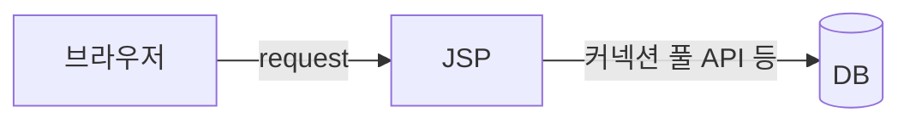

# 개요
- [[Java|자바]]에서 DB 접속을 위해 사용하는 객체, DB에 접속하기 위해서는 커넥션 풀이라는 API가 필요
	- [[JDBC]]에서 발전한 형태
- 커넥션풀의 조건사항
	- 데이터베이스의 칼럼과 변수명을 맞춰줘야함
- getConnection() 메서드를 호출하여 생성
	- 매개변수(Data의 위치, 기타정보(DB접속 id, 패스워드, 포트번호))
- 생성 코드 예시
	```java
	String url = "Date의 위치";
	String user = "hr";
	String pw = "hr";
	Class.forName("각 DB의 드라이버 이름");
	Connection conn = DriberManager.getConnection(url, user, pw);
	```
- Connection 객체 메서드 
	- createStatmeant()
		- SQL문을 DB에 전달하기 위한 Statement 객체를 생성해줌
	- proearStatement(String sql)
		- 파라미터가 포함된 SQL 문을 DB에 전달하기 위한 preareStatment 객체를 생성해줌
	- close()
		- 현재 커넥션 객체에 할당된 시스템 리소스를 즉시 반환
	- Context = javax.naming 패키지에 있는 걸 사용
		- 네임 서비스에 액세스 하기 위한 클래스 및 인터페이스 제공


# 커넥션 풀 설정하기
## 형식 (MemberDAO.java)
```java
package biz;

import java.sql.Connection;
import java.sql.PreparedStatement;
import java.sql.ResultSet;

import javax.naming.Context;
import javax.naming.InitialContext;
import javax.sql.DataSource;

// DB와 관련된 비지니스 로직을 처리하기 위한 클래스
public class MemberDAO {

	Connection conn;
	PreparedStatement pstml;
	ResultSet rs;
	
	
	// 커넥션 풀 이용 DB 연결메서드
	public void dbConn() {
		// 예외처리는 필수
		try {
			// 1. 외부에서 data를 읽어들이기 위한 Context 생성
			// xml의 컨텍스트 파일과 연결하기 위한것
			// server.xml <Context>의 설정과 관련
			Context intetx = new InitialContext();
			System.out.println("1. Context 생성 성공");
			// 2. 톰켓 서버에 정보를 담아놓은 곳으로 이동
			// lookup 메소드는 사용 환경을 찾는 메소드
			Context envctx = (Context) intetx.lookup("java:comp/env"); // 가장 잘 막힘
			System.out.println("2. Context 환경생성 성공!");
			// 3. DataSource 객체 선언, 톰켓 server.xml에 코딩한 문자열 값
			DataSource ds = (DataSource) envctx.lookup("jdbc/pool");
			System.out.println("3. DataSource 찾기 성공");
			// 4. DataSource를 기준으로 DB에 Connection 연결
			conn = ds.getConnection();
			System.out.println("4. DB 접속성공!");
			
			
		} catch (Exception e) {
			e.printStackTrace();
		}
	}
}

```


## server.xml
- Servers의 server.xml의 제일 하단 Context 태그에서 설정함
	```xml
	<Context docBase="Chap10_DbConnection" 
	path="/Chap10_DbConnection" 
	reloadable="true"
	source="org.eclipse.jst.jee.server:Chap10_DbConnection">
	</Context>
	</Host>
	```
- Resoure 추가
	```java
	<Resource auth="Container" 
	    driverClassName="oracle.jdbc.driver.OracleDriver"
	    loginTimeout="10" maxWait="5000" 
	    name="jdbc/pool" password="hr"
	    type="javax.sql.DataSource"
	    url="jdbc:oracle:thin:@localhost:1521:xe" username="hr" />
	```
	- name과 MemberDAO에서 설정한 ds lookup의 값을 맞춰줘야 함

# 커넥션 풀 흐름

1. dbConn()으로 DB 연결
2. 쿼리문 세팅
	- prepareStatement객체는 DB에 값을 편하게 넣기 위해 사용
	- ???를 통해서
3. 세팅한 쿼리문 실행
4. 자원 반납(DB 닫기)
	- DB가 계속 열려있으면 죽어버리거나 과부화될 수 있음


- 데이터는 다 레코드셋 타입
- ⚠️ 인용부호안에 물음표를 넣으면 안됨
- 아이디 값은 거의 PK로 사용되니까 변하지 않음
- SQL 커밋은 웹상에서 접속했을 경우 자동으로 이뤄지고 우리가 수동접속하면 수동으로 해야함

## DB에 접속하기 위한 비지니스 로직
- insert, update, delete의 흐름
	1. DB연결
	2. 쿼리문 세팅
	3. 세팅한 쿼리문 실행 : `pstml.executeUpdate();`
		- insert, update, delete시 사용 (int로 성공여부를 반환됨)
		- select만 특이하게 다른 쿼리문을 사용
	4. 자원 반납
- Read의 흐름
	1. MemberDAO의 selectMember()를 호출해서 자바빈 자료형이나 객체배열에 담기
	2. selectMember() 메소드의 흐름
		1. DB연결
		2. 쿼리문 세팅
		3. 세팅한 쿼리문 실행 : `pstml.executeQuery();`
		4. 자원 반납

