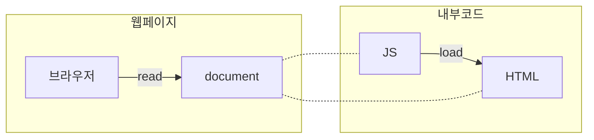

>바닐라 JS 란?  외부 라이브러리나 프레임워크를 사용하지 않은 순수 JS를 말함
>js는 크게 이벤트 리스너와 함수로 구성되는느낌

# 개요
- 앞으로 공부할 내용 
	- 스코트, 훅, 화살표 함수, 스프레드, 일급 객체개념, 클래스. this, Dom 제어

---
- 연관문서
	- [[JSDOC]], [[AJAX]]
	- 데이터 :  [[JSON]]
	- 프레임워크 : Node.JS
	- 라이브러리:  [[JQuery]]
- 참고문서 
	- [JS cheatsheet](https://www.interviewbit.com/javascript-cheat-sheet/) 
	- [JS 스타일가이드](https://github.com/tipjs/javascript-style-guide#%EB%AA%A9%EC%B0%A8)
	- JS run time
	- [ES6](https://nomadcoders.co/es6-once-and-for-all) 
	- [ES2020](https://frontdev.tistory.com/m/entry/ES2020-7%EA%B0%80%EC%A7%80-%EC%83%88%EB%A1%9C%EC%9A%B4-%ED%8C%81)
	- 이벤트 : https://jenny-daru.tistory.com/17
- 질문
	-  (변수 or 예약어).함수(인수) <- 이런식으로 JS에서 진행되는건가
	- 커피 스크립트, 타입 스크립트, 자바스크립트 슈퍼셋
---
# Why JS?
|      | 설명                                                                                                                       |
|:----:| -------------------------------------------------------------------------------------------------------------------------- |
| 역사 | • 10일만에 개발됨                                                                                                          |
|      | • JAVA와는 공통점 ❌                                                                                                       |
|      | • 넷스케이프를 만들기 위해 자바스크립트가 탄생                                                                             |
|      | → 당시 HTML과 CSS 밖에 없었기에 탄생                                                                                       |
| 장점 | • 브라우저에 내장되어 있음(안드로이드, 애플, 크롬 등)                                                                      |
|      | • 유일한 프론트엔드 웹 프로그래밍 언어                                                                                     |
|      | • 최근에는 JS로 백엔드 개설이 가능                                                                                         |
|      | 웹을 위한 언어였으나 최근에는 서버 쪽에도 쓰인다.예전에는 단순히 웹에서 사용자와 상호작용을 하기 위해서 사용되던 언어였다. |
|      | 현재 V8 엔진을 기반으로 만들어진 Node.js 등으로 인하여 백엔드에서도 사용, 지금 가장 유행하는 언어                          |
|      | Angular, ReactJS, VueJS 프레임워크 등으로 인해 전성기임                                                                    |
| 단점 | • 컴파일러가 코더의 잘못을 지적하지 않음(Bool + 1 등을 그대로 표현하려함)                                                  |
|      | • 따라서 그 단점을 잡기 위해서는 Typescript가 필요                                                                         |
| 활용 | 브라우저에서 동작하는 JS                                                                                                   |
|      | • HTML 문서의 요소를 조작(생성, 삭제 등)                                                                                   |
|      | • 문서 내 요소들의 스타일을 지정하거나 변경                                                                                |
|      | • 클릭, 입력 등의 사용자가 발생시키는 이벤트 처리                                                                          |
|      | • 브라우저에 데이터 저장                                                                                                   |
|      | • 서버에 요청 전송                                                                                                         |
|      | • 서버로부터 최선의 데이터 패치                                                                                            |
|      | 브라우저 밖에서 동작하는 JS                                                                                                |
|      | • 백엔드 개발(Express 등)                                                                                                  |
|      | • 모바일 앱 개발(lonic, React Native 등)                                                                                   |
|      | • 데스크톱 앱 개발(Electron 등)                                                                                            |
|      | • slocket.io를 사용해 실시간 기능을 가능하게 함                                                                            |
|      | • ml5.js머신러닝 개발도 가능                                                                                               |
| ES6? | 프로그래밍 언어로 부족했었던 자바 스크립트의 문제를 보완한 버전으로 중요하게 다뤄짐                                        |

# 바닐라 JS
## 1. 기본 문법
### 1.1. 변수(variable)
1. const : 상수
2. let : 변수
- var : 최근에는 안씀
	-   이전 버전의 JS에서 변수를 선언하기 위해 사용했던 키워드
	-   변수의 중복 정의를 제한하지 않는 등의 치명적인 단점이 있어, 더이상 var를 사용하지 않음 
- [[프로그래밍 언어론#^0ceace|카멜표기법]]으로 변수를 작성함

### 1.2. 자료형(types)
![[Pasted image 20221017125852.png]]
- 원시 타입(primitive type)과 참조 타입(Non primitive type)의 차이
	- 원시형은 값 직접 조작
		```js
		var foo = 1,
		    bar = foo;
		bar = 9;
		console.log(foo, bar); // 1, 9
		```
	- 참조형은 참조를 통해 값 조작
		```js
		var foo = [1, 2],
		    bar = foo;
		bar[0] = 9;
		console.log(foo[0], bar[0]); //9, 9
		```
#### 1.2.1. 원시 타입(primitive type)
- 숫자
- 문자열
	```js
	/* 문자열은 큰따옴표보다 작은따옴표 */
	var name = 'Josh';
	
	/* 80자 이상 문자열은 +를 사용하여 여러 줄로 */
	var errorMessage = 'This is super long error \
	어쩌구 저쩌구\
	저쩌구 럴럴럴.'; // bad
	
	var errorMessage = 'This is super long error'+
	    '어쩌구 저쩌구'+
	    '저쩌구 럴럴럴.'; // good
	
	/* 프로그램적으로 문자열 연결할 때에는 Array.join()을 활용 */
	items.join('</li><li>');
	```
- Unddfinded: 변수가 정의되지 않음
- Null : 값 없음, no auto, 파이썬에서는 none
- 부울(Boolean) 

#### 1.2.2. 참조 타입(non primitive type)
- 예약어보다 동의어 사용. 예약어를 키로 사용하면 IE8에서 동작 X
- new 연산자는 bad
	```js
	var item = new Object();
	```
- 되되록 아래 예시처럼 리터널 구문을 사용할것
- 속성 접근하려면 [] 대신 점(.)연산자 사용
---
- **object (객체)**
	```js
	const player = { };
	console.log(player.name); //or player["name"]
	player.lastName = "potato"; //오브젝트에 추가
	```
- **Array (배열)**
	```js
	const dayOfWeek = ["mon", "tue"];
	console.log(dayOfWeek[1]);
	dayOfWeek.push = "wne"; //배열에 추가
	```
	- 길이를 알 수 없는 경우엔 push
		```js
		arr[arr.length] = 'aa'; //bad
		arr.push('aa'); //good
		```
	- 배열 복사하고 싶을 땐 slice
		```js
		for(i=0; i<len; i++) { //bad
				itemsCopy[i] = items[i];
			}
		itemsCopy = items.slice(); //good
		```
	- array-like object를 Array에 변환
		```js
		var args = Array.prototype.slice.call(arguments);
		```
- **Function (함수)** 
	```js
	function 함수명(매개변수) {
		실행코드;
	}
	함수명(인수);
	```
	- 인수(argument) : 함수를 실행하는 동안 어떤 정보를 함수에 보낼 수 있음
	- 리턴(Return) : 값 반환,  function안에서 return 밑에 더 써도 return만 작업하고 더 실행 ❌
	- (if, while 등)블록 내에서는 함수 선언 대신 함수 할당을 해라. 브라우저마다 다른방식으로 해석
	- 매개변수에 arguments라 쓰지 말자. 예약어이다. (함수 범위로 전달 될 arguments 객체 덮어씀)
- **조건식과 등가식** 
	-   `==`, `!=`보단 `===`, `!==`를 사용
#### 1.2.3. 타입  변환
- parseInt : 숫자면 정수형으로 변환 아니면 NaN 출력
	```js
	parseInt(string, radix) //radix(옵션) 진수, 기본값이 10이 아님 
	```

### 1.3. 주석
- `// or /_주석_/`
- ``/** */``  :  [[JSDOC]]를 이용하여 JS 함수에 대한 설명을 작성할 수 있음

### 1.4. 연산자(operator)
- 기본 연산자 : `+`, `-`, `*`, `/`(나눗셈), `%`(나머지), `**`(지수)
- 증감 연산자 : `++`, `--`
- 비교 연산자 : `<, >`, `<=, >=`, `==, ===`, `!=, !==`
- 논리 연산자 : `&&`,` ||`, `!`
- 삼항 연산자 : `조건 ? '참일 경우 실행결과' : '거짓일 경우 실행결과'`
- 비트 연산자 : `&`, `|`, `~`, `^`, `<<`, `>>`
	- JS의 경우 지원하긴 하지만 사용할 일 거의 ❌
- Nullish 연산자 : `a ?? b` null이나 정의되지 않았으면 패스, 값이 확정된 변수를 찾는 연산자
- 대입 연산자 : `+=`, `-=`, `*=`, `/=`, `%=`, `**=`, `&&=`, `||=`, `??=`
	```js
	let number = 10;
	number += 2; // number = number + 2와 동일
	```
#### 1.4.1. 전개 구문(Spread Syntax)
- 전개구문 연산자 : `(...)`
- 반복이 가능한 객체제 적용할 수 있는 문법으로 배열이나 객체, 문자열의 요소를 각각 꺼내서 전개함.
- 예시 코드
	```js
	const hello = 'Hello';
	const world = 'World';
	const arr = [0,1];
	function sum(a, b){
		return a+b;
	}
	console.log(...hello, ...world);
	console.log(sum(...arr));
	```
---
### 1.5. 조건문
#### 1.5.1. IF ~ else 문
- if 문 구문
	```js
	if(조건) {조건이 참이라면 실행}
	```
#### 1.5.2. switch문
- switch 구문
	```js
	switch(인수) {
	case 조건: //조건이 일치하는 케이스면 실행
		실행코드
		break; //탈출
	default // 케이스를 제외한 값이 들어왔을 때 실행되는 케이스 
		실행코드
	}
	```
- break를 누락하면 내부의 코드를 모두다 실행하게 됨
	- defult는 마지막에 기술되므로 사용 ❌
### 1.6. 반복문
#### 1.6.1. For문 : 조건을 만족하면 계속 반복
- for문 구문
	```js
	for (let a = 0; a < 10; a++) {
		const randomNum = Math.floor(Math.random()*100);
		if(randomNum > 90){
			console.log(`A : ${randomNum}`);
		} else if(randomNum > 80){
			console.log(`B : ${randomNum}`);
		} else if(randomNum > 70){
			console.log(`C : ${randomNum}`);
		} else{
			console.log(`낙제 : ${randomNum}`);
		}
	}
	```
	
- break :  반복문 탈출 
- continue : 현재 반복을 종료하고 다음 반복으로 넘기는 명령어
#### 1.6.2. For of 문 : 주어진 객체를 순회
- for문과 비슷하게 생겼지만, 변수명 of 그리고 반복이 가능한 객체를 순서대로 작성
- for of 구문
	``` js
	let randomArr = [];
	for (let a = 0; a < 10; a++) {
	    const randomum = Number(Math.floor(Math.random()*100));
	    randomArr.push(randomum);
	}
	for (const i of randomArr) {
	    let aorborc // const 사용하면 에러남, 아무래도 배열이 끝나야 끝나는 반복문이니까 상수로 선언하면 값을 바꿀 수 없어서 에러가 나는 것 같아
	    if (i > 90 ) {
	        aorborc = "A"
	    } else if (i > 80 ) {
	        aorborc = "B"
	    } else if (i > 70 ) {
	        aorborc = "C"
	    } else  {
	        aorborc = "낙제"
	    }
	    console.log(`${aorborc} : ${i}`);
	}
	```
#### 1.6.3. while 문 : 조건 만족시 반복
```js
let i = 0;
while(i<10){
	console.log(i);
	i++;
}
```
#### 1.6.4. do while 문 : 조건의 Bool과 상관없이 최소 한번은 먼저 실행되고, 만족시 반복
```js
let i = 0;
do {
	console.log(i);
	i++;
} while(i<10)
```


### 1.7. 함수(Funtion)
```js
funtion 이름(매개변수) {
	실제 실행코드;
}
이름(인수);
```
- 인수 Agument : 함수를 호출할 때 전달하는 값
	- 인수를 적게 전달해도 JS는 오류가 나지 않음
		-> 함수 인자의 기본 값이 `undefined`로 지정되기 때문
	- 더 많이 전달시 정상적으로 출력
		-> arguments라는 지역변수에 배열처럼 저장되어, 초과된 인수를 무시할 뿐 오류는 발생안함
- 매개변수 [[파라미터|Parameter]] : 함수를 정의할 때 작성하는 필요 인자
	- 인자에 기본 값을 설정할 수 있음
- 함수 내부에서 선언되면 지역변수, 전역변수와 이름이 동일시 지역변수 우선
- 나머지 인자 구문`(...변수명)` 사용가능
- `return` 을 사용해 현재 함수 종료 후, 지정한 값을 함수의 호출지점으로 반환
#### 1.7.1. 함수 표현식
1. 화살표 함수

## 2. 이벤트(Event)

## 3. ES6, ES7, ES8 : JS의 표준화 문법
> ES6이란? ES6을 기점으로 JS는 큰 변화를 맞이함
### 3.1. 자료형
#### 3.1.1. Set
- 중복 허용 ❌, 아예 중복된 값이 들어가지 않음
- Set 구문
	```js
	const set = new Set();
	```
#### 3.1.2. Map
- object 같이 키와 값을 연결하는 방식의 데이터 집합
- Map 구문
	```js
	const map = new Map();
	map.set('Hello', 'World!'); // 키, 값
	```
##### 3.1.2.1. object와 Map의 차이
|      | 객체                              | 맵                    |
| ---- | --------------------------------- | --------------------- |
| 키값 | 문자 심벌 만                      | 모든 데이터 타입 허용 |
| 정렬 | ❌                                | 삽입된 순서대로       |
| 크기 | 키값 사용등으로 직접 판별         | map.size로 크기 바로 알 수 있음          |
| 순회 | 키값을 통해 배열을 얻어 배열 순회 | 맵 자체로 가능        |


## 4. JS 객체
- new 연산자로 객체 생성하는 줄 알고 있었는데 리터널 구문을 사용해서 객체를 생성하라고 하네 음 


# JS의 작동 원리 
## 1. JS로 HTML/CSS 수정하기

- HTML/CSS를 JS는 object(객체)형식으로 읽음(console.dir로 확인가능)
- [[웹 브라우저#^2c579d|웹 브라우저의 랜더링 과정]] 파트를 읽어보면 이해하기 쉬움
## 2. JS 런타임
- 운영체제의 스케줄링과 비슷하게 작동하는 듯

# Web API
## 1. 웹 브라우저 객체 모델 (BOM)

^559642

[[웹 브라우저#웹 브라우저 객체 모델 (BOM)|자세히 읽고 싶으면 여기로]]


### 1.1. window 객체
- 브라우저 창의 JS 인터페이스 ECMA 스크립트 Global 객체로 기능 #ECMA

#### 1.1.1. 전역 스코프

전역에서 선언한 변수와 함수는 모두 window객체의 프로퍼티/메서드

```js
var age = 29;
function sayAge(){
    alert(this.age) ;
}

alert(window.age); // 29
sayAge(); // 29
window.sayAge(); // 29
```

window를 생략해서 쓸 수 있다

window를 사용하지 않는 것과 사용하는 것이 약간의 차이 있음. window에 정의하는 경우 delete 연산자로 제거 가능

```
var age = 29;
window.color = "red"
// IE9 미만에서는 에러， 다른 브라우저에서는 모두 false 반환
delete window.age;
// IE9 미만에서는 에러， 다른 브라우저에서는 모두 true 반환
delete window.color;
alert(window.color); / / undefined
```

선언하지 않았을 가능성이 있는 변수의 존재 여부를 window 객체를 통해 확인 가능

```
// oldValue를선언한적 없으므로 에러가발생합니다
var newValue = oldValue ;

// 아래는프로퍼티 검색이므로 에러가발생하지 않습니다
// newValue는 undefìned로 설정됩니다
var newValue = window.oldValue;
```

#### 1.1.2. 창 사이의 관계와 프레임

```html
<htm1>
    <head>
        <tit1e>Frameset Examp1e</tit1e>
    </head>
    <frameset rows="160,*">
        <frame src="frame.htm" name="topFrame">
        <frameset cols="50%, 50%">
            <frame src="anotherframe.htm" name="leftFrame">
            <frame src="yetanotherframe.htm" name="rightFrame">
        </frameset>
    </frameset>
</html>
```

프레임에 접근하는 다양한 방법

```js
window.frames[O]
window.frames["topFrame"]
top.frames[O]
top.frames ["topFrame"]
frames[O]
frames["topFrame"]
```

top, parent, self 객체

#### 1.1.3. 창의 위치

창 위치를 판단하는 크로스 브라우저 코드 (IE, 오페라 vs 파이어폭스, 사파리/크롬은 양쪽 지원)

```js
var leftPos = (typeof window.screenLeft "number") ? window.screenLeft : window.screenX;
var topPos = (typeof window.screenTop "number") ? window.screenTop : window.screenY;
```

```js
// 창을 왼쪽 위 구석으로 옮깁니다
window.moveTo(0,0);
// 창을 아래쪽으로 100 픽셀 옮깁니다
window.moveBy(0, 100);
// 창을 (200, 30이으로 옮깁니다
window.moveTo(200, 300);
// 창을 왼쪽으로 50 픽셀 옮깁니다
window.moveBy(-S0, 0);
```

#### 1.1.4. 창 크기

outerWidth, outerHeight : 창 크기 innerWidth, innerHeight : 테두리, 툴바 포함되지 않은 창 크기

IE8에서는 DOM을 사용해서 알아냄 document.documentElement.clientWidth : 뷰포트 너비 document.documentElement.clientHeight : 뷰포트 높이

모바일에서는 창크기와 뷰포트의 값이 동일함 레이아웃 뷰포트는 또 다른 개념. 렌더링 된 페이지의 크기를 알 수 있음

```js
// 1OOx1OO으로 변경
window.resizeTo(100,100);
// 1OOx1OO에서 200x150으로 변경
window.resizeBy(200,150);
// 300x300으로 변경
window.resizeTo(300,300);
```

#### 1.1.5. 내비게이션과 열기

window.open() : 새 창 열기

```js
window.open("http://www.wrox.com/" , "topFrame");
// _self, _parent, _top, _blank 등도 쓸 수 있음

window.open("http://www.wrox.com/", "wroxWindow","height=400,width=400, top=10, left=10, resizable=yes");
// 다양한 매개변수 지정 가능 : width,height,left,location,menubar,resizable, scrollbars, status

// 창 닫기
wroxWin.close();
```

보안상 제한과 팝업 차단을 가정해서 작업해야 함

#### 1.1.6. 인터벌과 타임아웃

```js
// 이렇게 하면 ❌ : 성능이 떨어진다
setTimeout("alert(’Hello world!’)", 1000);

// 이렇게 ⭕
setTimeout(function() {
    alert("Hello world!");
}, 1000);
```

큐에 등록된 작업을 취소하려면 다음과 같이

```jsx
// 타임아웃설정
var timeoutId = setTimeout(function() {
    alert ("Hello world!");
}, 1000);

// 타임아웃취소 : 실행전에만 취소 가능
clearTimeout(timeoutId);
```

setInterval 도 유사함, setTimeout으로 대체 가능하기 때문에 잘 쓰지 않음

#### 1.1.7. 시스템 대화상자

alert(), confirm(), prompt() window.print(); // 인쇄 window.find(); // 찾기

### 1.2. location 객체

[[웹 브라우저]] 객체 이기도 함 window.location은 document.location과 동일함

location 프로퍼티 들

-   hash : URL 해시(#)
-   host : 서버 이름과 포트 변호(있다면)
-   hostname : 포트번호를 제외한 서버이름
-   href : 현재 페이지의 완전한 URL
-   pathname : URL에 포함된 디렉터리 및 파일 이름
-   port : 포트번호
-   protocol : 페이지에서 사용하는 프로토콜 ex)http:, https:
-   search : URL의 쿼리 스트링 부분

#### 1.2.1. 쿼리스트링 확장

location.search 프로퍼티가 URL의 물음표 다음을 반환하긴 하지만， 쿼리스트링 매개변수를 하나씩 분리해서 제공하지는 않습니다. 그래서 파싱해서 사용해야 함

```jsx
// 쿼리스트링이 ?q=Toby&num=10 라고가정합니다
var args = getQueryStringArgs();

alert(args["q“]); // "Toby"
alert(args["num"]); // "10"
```

#### 1.2.2. location 조작

```jsx
location.assign("http://lezhin.com"); // 페이지 이동
window.location = "http://lezhin.com";
location.href = "http://lezhin.com";

location.reload() ; // 가능하면 캐시에서
location.reload(true); // 항상 서버에서
```

### 1.3. navigator 객체

navigator 객체 프로퍼티

-   appCodeName
-   appMinorVersion
-   appName : 완전한브라우저 이름
-   appVersion : 브라우저 버전
-   buildID
-   cookieEnabled
-   cpuClass
-   javaEnabled()
-   language
-   mimeTypes
-   onLine
-   oscpu
-   platform
-   plugins
-   preference()
-   product
-   productSub
-   userAgent : 브라우저 문자열
-   userLanguage
-   userProfile
-   vendor
-   vendorSub

#### 1.3.1. 플러그인 감지

```jsx
// 플러그인 탐지 - IE에서는 동작하지 않습니다
function hasPlugin(name){
    name = name.toLowerCase();
    for (var i=0; i < navigator.plugins.length; i++){
        if (navigator.plugins[il.name.toLowerCase().indexOf(name)
            return true;
        }
    }
    return false;
}
// 플래시를찾음
alert(hasPlugin("Flash"));

// 퀵타임을찾음
alert(hasPlugin("QuickTime")) ;
```

IE는 예외처리해서 찾도록 함

#### 1.3.2. 처리기등록

HTML5에서 되살아난 registerContentHandler()와 registerProtocolHandler() 메서드

##### 1.3.2.1. registerContentHandler()

웹사이트가 특정한 마임 타입의 정보를 처리할 수 있음

```
// 어떤 사이트를 RSS 피드 처리기로 등록하기
navigator.registerContentHandler("application/rss+xml","http://www.somereader.com?feed=%s" , "Some Reader");
```

##### 1.3.2.2. registerProtocolHandler()

웹사이트가 특정한 프로토콜의 정보를 처리할 수 있음 ("mailto" , "ftp" 등)

### 1.4. screen 객체

픽셀 너비와 높이 등 클라이언트 화면에 관한 정보 많은 브라우저에서 이 기능을 제한하므로 이 코드는 동작하지 않을때가 많음

screen.width, screen.height 정도 사용함 iOS, Android 갱신 방식 다름

### 1.5. history 객체

```jsx
// 한페이지 뒤로
history.go(-1) ;

// 한페이지 앞으로
history.go(1) ;

// 두페이지 앞으로
history.go(2);

// 한페이지 뒤로
history.back() ;

// 한페이지 앞으로
history.forward();

if (history.length == 0){
  // 시용자가 이 페이지를 처음으로 열었을 때 실행할 코드
}
```
## 2. DOM API
### 2.1. 요소에 접근하기
1. 하나의 요소 노드를 선택하기
	-   getElementById(): 요소 유일한 id특성값 이용
	-   querySelector(): CSS선택자 이용. 일치하는 요소들 중 첫 번째 리턴
			또한, 돔 트리 내에서 한 요소로부터 다른요소 탐색해갈수 있다
2. 여러개의 노드를 선택
	-   getElementByClassName()
	-   getElementByTagName()
	-   querySelectorAll() _좀 느리다_
3. 요소 노드 사이 탐색
	-   parentNode : 현재요소의 부모노드 선택 (하나만 리턴)
	-   previousSibling / nextSibling : 현재 돔트리내의 이전/다음 형제요소
	-   firstChild/lastChild : 현재 요소의 첫/마지막 자식노드
### 2.2. 요소 조작하기
1. 텍스트 노드에 접근/수정
	- li요소 선택 후 firstChild속성을 사용해 텍스트 노드를 선택.
	-   nodeValue: 텍스트 노드의 유일한 속성.
2. HTML내용 조작
	-   innerHTML : 이 하나의 속성을 통해 모든 자식 요소와 텍스트 콘텐츠에 접근 가능 _보안에 취약_
		- innerText : 이건 뭐지
	-   textContent : 특정 요소의 텍스트 콘텐츠에만 접근
	-   createElement()
	-   createTextNode()
	-   appendChild() / removeChild()
3. 특성 값에 접근/수정
	-   className / id
	-   hasAttribute()
	-   getAttribute()
	-   setAttribute()
	-   removeAttribute()

## 3. Web Storage
### 3.1. Web Storage란?
- HTML5에는 웹사이트 데이터를 클라이언트에 저장할 수 있는 새로운 자료구조인 Web Storage스펙이 포함됨. 키-값 쌍으로 데이터를 저장하고 키를 기반으로 데이터를 조회하는 심플한 패턴. 
- Web Storage 종류는 2가지
	-   localStorage: 영구저장소
	-   sessionStorage: 임시저장소 처럼 데이터의 지속성을 구별하여 사용할 수 있다. [브라우저 지원 현황](http://caniuse.com/#search=localstorage)을 보면 현재 오페라 미니 빼고 모두 지원한다.

### 3.2. 쿠키와의 차이점
-   쿠키는 매번 서버로 전송됨
    -   Web storage는 저장된 데이터가 클라에 존재할 뿐 서버전송은 ❌ (=>네트워크 트래픽 비용을 줄여주는 중요한 장점)
-   단순 문자열을 넘어 (스크립트)객체(=object)정보를 저장 가능.
    -   체계적으로 구조화된 객체 저장 ⭕(브라우저 지원여부 확인 필요)
-   쿠키와 다르게 용량 제한 ❌
-   영구 데이터 저장 ⭕
    -   로컬스토리지는 브라우저 종료해도 데이터 보관, 세션스토리지는 데이터 지움.

### 3.3. 사용법

```js
localStorage.setItem('foo', 'bar'); //key와 value로 저장
localStorage.getItem('foo'); //'bar'
localStorage['foo']; //'bar'

localStorage.removeItem(키); //선택한 값 지움
localStorage.clear(); //모두 지움
localStorage.length; //저장된 키의 개수
localStorage.key(값); //값으로 키를 찾음

window.addEventListener('storage', function(e){ //이벤트 처리
    // do sth
}, false);
```

-   key와 value 모두 String으로 저장된다.
-   getItem으로 값 못찾으면, 에러 발생이 아니고 `null`리턴.
-  대부분의 브라우저에서는 다른 윈도우에서 로컬 스토리지의 데이터를 변경했을 때 이벤트가 발생한다. 즉, 같은 창에 이벤트를 추가하고, localStroage의 값을 변경해도 이벤트가 발생하지 않는다. 아마도, 자신의 window에서는 변경된 상황을 알고 있을 것이라는 가정 때문인가 보다. [링크](http://stackoverflow.com/questions/5370784/localstorage-eventlistener-is-not-called)

### 3.4. 세션스토리지 예제

```js
// Get the text field that we're going to track
var field = document.getElementById("field");
 
// See if we have an autosave value
// (this will only happen if the page is accidentally refreshed)
if (sessionStorage.getItem("autosave")) {
  // Restore the contents of the text field
  field.value = sessionStorage.getItem("autosave");
}
 
// Listen for changes in the text field
field.addEventListener("change", function() {
  // And save the results into the session storage object
  sessionStorage.setItem("autosave", field.value);
});
```

### 3.5. [localStorage에 json저장](http://stackoverflow.com/questions/2010892/storing-objects-in-html5-localstorage) [참고](http://stackoverflow.com/questions/23728626/localstorage-and-json-stringify-json-parse)

```js
var testObject = { 'one': 1, 'two': 2, 'three': 3 };

// Put the object into storage
localStorage.setItem('testObject', JSON.stringify(testObject));

// Retrieve the object from storage
var retrievedObject = localStorage.getItem('testObject');

console.log('retrievedObject: ', JSON.parse(retrievedObject));
```
- localStorage는 문자열로 저장되어야 하기 때문에 json으로 저장해도 일단 문자열로 변환되어 저장 -> 꺼낼때는 json으로 변환

### 3.6. [localStorage모든 아이템 꺼내오기](http://stackoverflow.com/questions/17745292/all-local-storage-items)

```js
function allStorage(){

    var archive = [],
        keys = Object.keys(localStorage),
        i = 0;

    for (; i < keys.length; i++) {
        archive.push( localStorage.getItem(keys[i]) );
    }

    return archive;
}
```


## 4. canvas API
- canvas란?
    - 윈도우의 창과 비슷하다
    - html로 많은걸 할 필요가 없다?
        - JS에서 canvas를 사용해 브라우저에 2D 혹은 3D 그래픽을 그릴 수 있음
    - context : 그림그릴 때 사용하는 붓
```js
	    const ctx = canvas.getContext("2d");
```
 
```js
    // 선을 그리기 시작할때 js에서만 가로세로를 수정, css에서는 안함 -> canvas의 퀄리티를 위해서
    canvas.width = 600;
    canvas.height = 600;
    
    // 좌표(x,y), 크기(x,y)
    ctx.rect(50, 50, 100,100);
    ctx.rect(150, 150, 100,100);
    ctx.rect(250, 250, 100,100);
    ctx.rect(450, 450, 100,100);
    ctx.stroke();
    
    // beginPath는 위와 아래를 분리시켜줌
    ctx.beginPath();
    ctx.rect(350, 350, 100,100);
    ctx.fillStyle = "red";
    ctx.fill();
    
    /**
     * fillRect과 strokeRect의 차이
     * 둘다 경로를 생략했음(선을 그리고 채워넣는 과정)
     * 1) 선을 rect() 함수로 그리고 
     * 2) fill로 색을 채운다
     * 색을 채워넣지 않으면 나타나지 않음
     */
    ```

# JS와 함께 사용되는 툴
- **redux** : 상태관리
- **webpack :** 여러개 파일을 하나의 파일로 합쳐주는 모듈 번들러(Module bundler)
	- https://serzhul.io/JavaScript/learn-webpack-in-under-10minutes/


# 용어정리
- **폴리필** : 브라우저에서 지원하지 않는 코드에 대해 사용가능하게 구현하는 코드를 의미
- **바벨** : 차세대 문법을 ES5 문법으로 번역해주는 역할